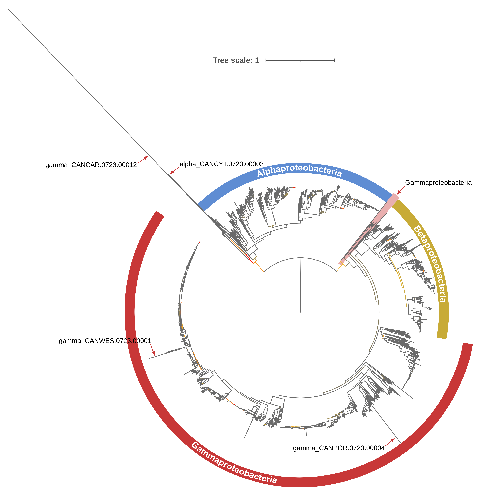
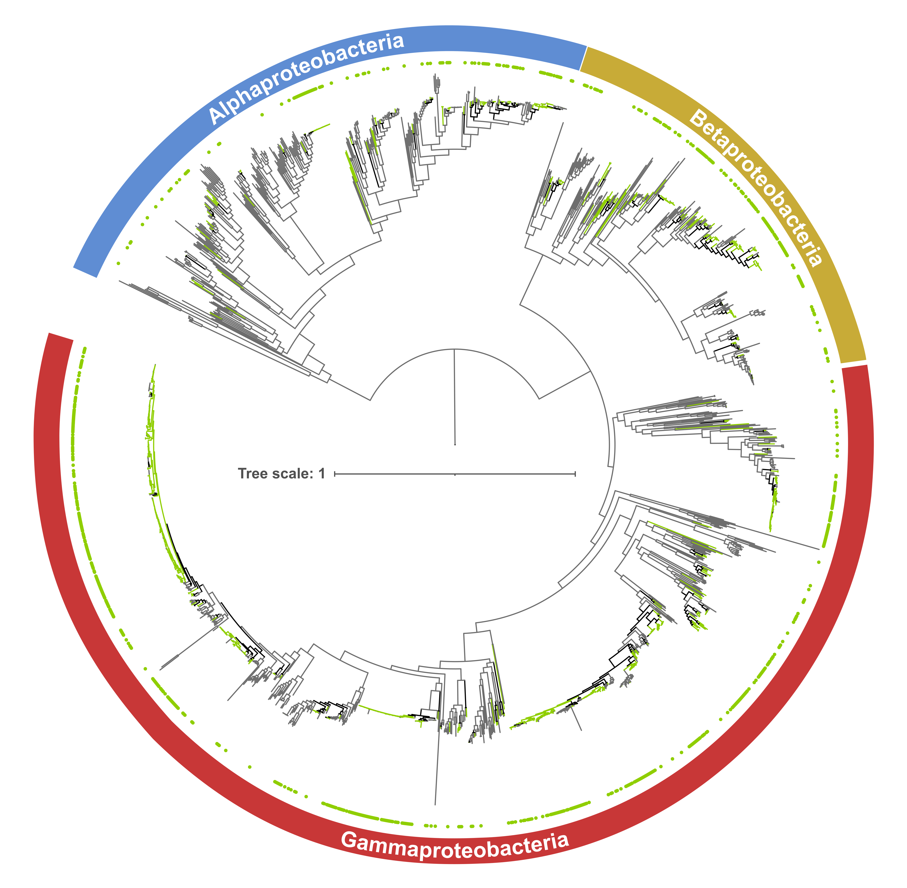

# LysR and the Mystery Operon

In this part of the project, we will analyze the origin of the *lysR-pfp-ifp* cluster, a small genetic region present in many species of Proteobacteria. We will start by identifying the cluster in a large database of Proteobacteria, followed by constructing two phylogenies of Proteobacteria: one with the protein sequences of the cluster genes, and another with universal genetic markers for ancestral character reconstruction (ACR). We will also compute the CG content and codon adaptation index (CAI) of the cluster and compare it to those of the chromosome.

## Project setup and RefSeq database

Create the project directory from which run all commands:

```sh
mkdir -p RNA-Seq_enterobacteria_pOXA-48/LysR_and_the_mystery_operon
cd RNA-Seq_enterobacteria_pOXA-48/LysR_and_the_mystery_operon
mkdir ncbi_dataset_gamma/
mkdir ncbi_dataset_alpha/
mkdir ncbi_dataset_beta/
mkdir ncbi_dataset_delta/
mkdir ncbi_dataset_epsilon/
mkdir ncbi_dataset_zeta/
```

At the [NCBI Genome database](https://www.ncbi.nlm.nih.gov/datasets/genome/): (i) search for all Gamma-, Alpha-, Beta-, Delta-, Epsilon- and Zetaproteobacteria genomes (independently), (ii) filter by "Annotated by NCBI RefSeq" and Assembly Level "chromosome" and "complete", (iii) download all RefSeq genomes of the different classes of Proteobacteria into their respective `ncbi_dataset_<class>` directory. The database used in this project was downloaded on July 14th and includes:
* 16,219 Gammaproteobacteria
* 2,441 Alphaproteobacteria
* 2,878 Betaproteobacteria
* 5 Deltaproteobacteria
* 1,086 Epsilonproteobacteria
* 2 Zetaproteobacteria

Inside each `ncbi_dataset_<class>` directory there should be a subdirectory for each strain (with the assembly accession name of the strain, like GCF_\<code>) and a data_summary.tsv file including metadata for each strain. To facilitate working with the database, a species code was given to all strains. The species code is composed of the three first letters of the genera and the first three letters of the species, followed by the date of the database and a strain number (from 1 to *n* for each *n* strain of a species, e.g. ESCCOL.0723.00001 for *E. coli* strain 1).

The script **generate_sp_code.py** was developed to create a **data_information.tsv** table for each class of Proteobacteria that adds the species code column to the metadata. Run the following commands to generate the data_information.tsv table in the respective directory and rename the each strain's subdirectory from the assembly accession number to the species code:

 ```sh
 cd ./ncbi_dataset_gamma
 ../generate_sp_code.py
 awk -F'\t' '{print "mv "$7" "$1}' data_information.tsv | grep -v "Species" | xclip -selection clipboard
 # mv commands (to rename subdirs) are automatically copied to the clipboard
 # paste the output in the terminal to run the copied mv commands

 cd ../ncbi_dataset_alpha
 ../generate_sp_code.py
 awk -F'\t' '{print "mv "$7" "$1}' data_information.tsv | grep -v "Species" | xclip -selection clipboard
 # paste the output in the terminal to run the copied mv commands

 cd ../ncbi_dataset_beta
 ../generate_sp_code.py
 awk -F'\t' '{print "mv "$7" "$1}' data_information.tsv | grep -v "Species" | xclip -selection clipboard
 # paste the output in the terminal to run the copied mv commands

 cd ../ncbi_dataset_delta
 ../generate_sp_code.py
 awk -F'\t' '{print "mv "$7" "$1}' data_information.tsv | grep -v "Species" | xclip -selection clipboard
 # paste the output in the terminal to run the copied mv commands

 cd ../ncbi_dataset_epsilon
 ../generate_sp_code.py
 awk -F'\t' '{print "mv "$7" "$1}' data_information.tsv | grep -v "Species" | xclip -selection clipboard
 # paste the output in the terminal to run the copied mv commands

 cd ../ncbi_dataset_zeta
 ../generate_sp_code.py
 # paste the output in the terminal to run the copied mv commands
 cd ..
 ```

Now, each strain's subdirectory should be named with the species code. The files inside each of these subdirectories are: the genomic fasta file (\<assembly_accession>.fna), the annotation genomic.gff file and the protein.faa file (protein sequences are ordered alphabetically).

MacSyFinder needs as input the protein FASTAs with the sequences ordered by genomic position. However, the default protein.faa files downloaded from NCBI are in alphabetical order. The script **sort_faa.py** was used to order the proteins.faa files by genomic position (extracted from the genomic.gff files), resulting in the \<species_code>.faa files:

```sh
cd ./ncbi_dataset_gamma
../sort_faa.py
cd ../ncbi_dataset_alpha
../sort_faa.py
cd ../ncbi_dataset_beta
../sort_faa.py
cd ../ncbi_dataset_delta
../sort_faa.py
cd ../ncbi_dataset_epsilon
../sort_faa.py
cd ../ncbi_dataset_zeta
../sort_faa.py
cd ..
```


## Identifying the *lysR-pfp-ifp* cluster with MacSyFinder

A MacSyFinder v2.0 model, **MysteryOperonFinder** (available [here](https://github.com/LaboraTORIbio/RNA-Seq_enterobacteria_pOXA-48/tree/main/LysR_and_the_mystery_operon/MysteryOperonFinder)), was constructed to identify the *lysR-pfp-ifp* cluster (hereon referred to as *cluster* in the text or *operon* in file/dirs names) in the Proteobacteria database. To construct the model, the Pfam HMM profiles (release 35.0) of the three proteins (LysR: PF03466, PFP: PF02678, IFP: PF00857) were downloaded from InterPro v95.0 after an InterProScan 5 search, into the model directory `MysteryOperonFinder/profiles/`.

The model is configured to find systems that contain the three genes consecutively (min_mandatory_genes_required = 3, min_genes_required = 3, inter_gene_max_space = 0), although order and sense cannot be specified. Then, the model is used with **MacSyFinder v2.1.1** to find the cluster (also called system or model by MacSyFinder) in the database (change the --models-dir path to where you stored the model):

```sh
for directory in ncbi_dataset_gamma/*; do
	if [ -d "$directory" ]; then
		faafiles=("$directory"/*.faa)
		for file in "${faafiles[@]}"; do
			# Check if the file is not protein.faa
			if [ "$(basename "$file")" != "protein.faa" ]; then
				strain=${file:37}
				strain=${strain::-4}
				macsyfinder --models MysteryOperonFinder all --models-dir ~/Software/macsy_models_v2/ --db-type ordered_replicon --replicon-topology circular --sequence-db $file -o macsyfinder_operon/gamma/$strain
			fi
		done
	fi
done

for directory in ncbi_dataset_alpha/*; do
	if [ -d "$directory" ]; then
		faafiles=("$directory"/*.faa)
		for file in "${faafiles[@]}"; do
			# Check if the file is not protein.faa
			if [ "$(basename "$file")" != "protein.faa" ]; then
				strain=${file:37}
				strain=${strain::-4}
				macsyfinder --models MysteryOperonFinder all --models-dir ~/Software/macsy_models_v2/ --db-type ordered_replicon --replicon-topology circular --sequence-db $file -o macsyfinder_operon/alpha/$strain
			fi
		done
	fi
done

for directory in ncbi_dataset_beta/*; do
	if [ -d "$directory" ]; then
		faafiles=("$directory"/*.faa)
		for file in "${faafiles[@]}"; do
			# Check if the file is not protein.faa
			if [ "$(basename "$file")" != "protein.faa" ]; then
				strain=${file:36}
				strain=${strain::-4}
				macsyfinder --models MysteryOperonFinder all --models-dir ~/Software/macsy_models_v2/ --db-type ordered_replicon --replicon-topology circular --sequence-db $file -o macsyfinder_operon/beta/$strain
			fi
		done
	fi
done

for directory in ncbi_dataset_delta/*; do
	if [ -d "$directory" ]; then
		faafiles=("$directory"/*.faa)
		for file in "${faafiles[@]}"; do
			# Check if the file is not protein.faa
			if [ "$(basename "$file")" != "protein.faa" ]; then
				strain=${file:37}
				strain=${strain::-4}
				macsyfinder --models MysteryOperonFinder all --models-dir ~/Software/macsy_models_v2/ --db-type ordered_replicon --replicon-topology circular --sequence-db $file -o macsyfinder_operon/delta/$strain
			fi
		done
	fi
done

for directory in ncbi_dataset_epsilon/*; do
	if [ -d "$directory" ]; then
		faafiles=("$directory"/*.faa)
		for file in "${faafiles[@]}"; do
			# Check if the file is not protein.faa
			if [ "$(basename "$file")" != "protein.faa" ]; then
				strain=${file:39}
				strain=${strain::-4}
				macsyfinder --models MysteryOperonFinder all --models-dir ~/Software/macsy_models_v2/ --db-type ordered_replicon --replicon-topology circular --sequence-db $file -o macsyfinder_operon/epsilon/$strain
			fi
		done
	fi
done

for directory in ncbi_dataset_zeta/*; do
	if [ -d "$directory" ]; then
		faafiles=("$directory"/*.faa)
		for file in "${faafiles[@]}"; do
			# Check if the file is not protein.faa
			if [ "$(basename "$file")" != "protein.faa" ]; then
				strain=${file:36}
				strain=${strain::-4}
				macsyfinder --models MysteryOperonFinder all --models-dir ~/Software/macsy_models_v2/ --db-type ordered_replicon --replicon-topology circular --sequence-db $file -o macsyfinder_operon/zeta/$strain
			fi
		done
	fi
done
```

MacSyFinder outputs several files. We will work with the all_systems.txt file. If no cluster was identified, the file displays the text "# No Systems found", while if one or more clusters were detected, the all_systems.txt file informs "# Systems found:", and then lists the system(s) identified. The relevant information of the system lines is:
* *system id = \<species_code>_model_n* (n is the number given to each system identified),
* *clusters = [('WP_002898927.1', 'isochorismatase_PF00857', 1959), ('WP_004199757.1', 'pirin_PF02678', 1960), ('WP_015874629.1', 'lysR_PF03466', 1961)]*, identifying the ID of each cluster protein.


```sh
echo "Of 16,219 Gammaproteobacteria," $(grep "# Systems found:" macsyfinder_operon/gamma/*/best_solution.tsv | wc -l) "have the cluster"
# Of 16,219 Gammaproteobacteria, 6993 have the cluster
echo "Of 2,441 Alphaproteobacteria," $(grep "# Systems found:" macsyfinder_operon/alpha/*/best_solution.tsv | wc -l) "have the cluster"
# Of 2,441 Alphaproteobacteria, 211 have the cluster
echo "Of 2,878 Betaproteobacteria," $(grep "# Systems found:" macsyfinder_operon/beta/*/best_solution.tsv | wc -l) "have the cluster"
# Of 2,878 Betaproteobacteria, 201 have the cluster
echo "Of 5 Deltaproteobacteria," $(grep "# Systems found:" macsyfinder_operon/delta/*/best_solution.tsv | wc -l) "have the cluster"
# Of 5 Deltaproteobacteria, 0 have the cluster
echo "Of 1086 Epsilonproteobacteria," $(grep "# Systems found:" macsyfinder_operon/epsilon/*/best_solution.tsv | wc -l) "have the cluster"
# Of 1086 Epsilonproteobacteria, 0 have the cluster
echo "Of 2 Zetaproteobacteria," $(grep "# Systems found:" macsyfinder_operon/zeta/*/best_solution.tsv | wc -l) "have the cluster"
# Of 2 Zetaproteobacteria, 0 have the cluster
```

The cluster is only present in Gamma- (n = 6993), Alpha- (n = 211) and Betaproteobacteria (n = 201), so from hereon, we will perform the analyses with only these classes of Proteobacteria. With the following commands, get the number of strains that have more than one cluster identified (note that the MacSyFinder results file analyzed is all_systems.txt):

```sh
grep -E "model_[2|3|4]" macsyfinder_operon/gamma/*/all_systems.txt | cut -d"/" -f3 | sort | uniq | wc -l
# 24 strains
grep -E "model_[2|3|4]" macsyfinder_operon/alpha/*/all_systems.txt | cut -d"/" -f3 | sort | uniq | wc -l
# 18 strains
grep -E "model_[2|3|4]" macsyfinder_operon/beta/*/all_systems.txt | cut -d"/" -f3 | sort | uniq | wc -l
# 32 strains
```

The majority of strains encode only one cluster. Strains with more than cluster detected (24 gamma, 18 alpha and 32 beta) are inspected manually and only one system is selected: the one with the LysR with better hit against the LysR of pOXA-48 (BLASTp commands below, place **lysR_pOXA-48.faa** in `./blastp_LysR_pOXA-48_db/`), modifying the all_systems.txt file to leave only one model.

```sh
mkdir -p blastp_LysR_pOXA-48_db/gamma/
mkdir -p blastp_LysR_pOXA-48_db/alpha/
mkdir -p blastp_LysR_pOXA-48_db/beta/

for directory in ncbi_dataset_gamma/*; do if [ -d "$directory" ]; then faafiles=("$directory"/*.faa); for file in "${faafiles[@]}"; do if [ "$(basename "$file")" != "protein.faa" ]; then strain=${file:37}; strain=${strain::-4}; makeblastdb -in $file -dbtype prot; blastp -query lysR_pOXA-48.faa -db $file -outfmt 6 > blastp_LysR_pOXA-48_db/gamma/$strain".tsv"; fi; done; fi; done
for directory in ncbi_dataset_alpha/*; do if [ -d "$directory" ]; then faafiles=("$directory"/*.faa); for file in "${faafiles[@]}"; do if [ "$(basename "$file")" != "protein.faa" ]; then strain=${file:37}; strain=${strain::-4}; makeblastdb -in $file -dbtype prot; blastp -query lysR_pOXA-48.faa -db $file -outfmt 6 > blastp_LysR_pOXA-48_db/alpha/$strain".tsv"; fi; done; fi; done
for directory in ncbi_dataset_beta/*; do if [ -d "$directory" ]; then faafiles=("$directory"/*.faa); for file in "${faafiles[@]}"; do if [ "$(basename "$file")" != "protein.faa" ]; then strain=${file:36}; strain=${strain::-4}; makeblastdb -in $file -dbtype prot; blastp -query lysR_pOXA-48.faa -db $file -outfmt 6 > blastp_LysR_pOXA-48_db/beta/$strain".tsv"; fi; done; fi; done
```

Since MacSyFinder does not allow to set the order of the genes and/or genes might be duplicated, the next filtering step is done to remove systems/models with incorrect order or with duplicated genes (since we only require one sequence per gene per strain for phylogeny reconstruction). The **find_abnormal_systems_1.py** script was developed for this. It can be run like `./find_abnormal_systems_1.py` (important: for each class of Proteobacteria, change the results path inside the script, e.g. macsyfinder_operon/gamma/). An example output of this script, showing the strain name and the abnormal systems, is:

```sh
## Gamma
# LUTAEG.0723.00003	pirin_lysR_isochorismatase
# ACIGYL.0723.00001	isochorismatase_lysR_lysR_isochorismatase_pirin
# ACICAL.0723.00005	isochorismatase_lysR_lysR_isochorismatase_pirin
# ACICAL.0723.00001	pirin_isochorismatase_lysR_lysR_isochorismatase
# ACIPRO.0723.00001	isochorismatase_lysR_lysR_pirin
# ROUCHA.0723.00001	pirin_isochorismatase_lysR_pirin
# ERWBIL.0723.00001	pirin_isochorismatase_lysR_pirin
# SHEPIE.0723.00001	pirin_lysR_isochorismatase
# ACIHAE.0723.00006	isochorismatase_lysR_lysR_isochorismatase_pirin
# ACICAL.0723.00002	isochorismatase_lysR_lysR_isochorismatase_pirin
# ACISP..0723.00041	pirin_isochorismatase_lysR_lysR_isochorismatase
# ...
```

407 Gammaproteobacteria, 66 Alpha- and 81 Betaproteobacteria strains had systems with incorrect order. The all_systems.txt files of these strains are manually inspected and modified. If *lysR* is between the pirin and isochorismatase or if the pirin and isochorismatase are in opposite directions (inspecting the annotation GFF file), the file is ended with "# No Systems found". When there is/are additional gene(s) (eg. [isochorismatase_lysR_]lysR_pirin_isochorismatase, lysR_pirin_isochorismatase_[isochorismatase] or [lysR_]lysR_pirin_isochorismatase), the all_systems.txt is edited so only the lysR, pirin and isochorismatase are left together.

As a second round to check correct systems, the **find_abnormal_systems_2.py** script was written. Ran like `./find_abnormal_systems_2.py` (changing class directory inside script), it connects MacSyFinder results with the annotation GFF files to print the strains that for some format issue were parsed incorrectly or that have more than three genes. The second column is the number of genes parsed:

```sh
## Gamma
# ACIPIT.0723.00028	4
# AERVER.0723.00055	4
# ALCSP..0723.00002	4
# ENTROG.0723.00015	5
# ENTROG.0723.00031	5
# KLEPNE.0723.01505	4
# MARSAL.0723.00002	4
# MARSP..0723.00022	4
# PSECHL.0723.00034	4
# PSECHL.0723.00044	4
# PSECIT.0723.00002	4
# PSECIT.0723.00005	4
# PSECIT.0723.00006	4
# PSEIZU.0723.00001	4
# PSESP..0723.00006	487
# PSESP..0723.00015	4
# PSESP..0723.00024	4
# PSESP..0723.00027	4
# PSESP..0723.00094	5
# PSESP..0723.00097	5
# PSESP..0723.00138	4
## Alpha: none
## Beta:
# CUPTAI.0723.00017	4
# CUPTAI.0723.00034	4
# CUPTAI.0723.00032	4
# PELRAT.0723.00001	4
```

Inspecting the GFF files, in Gammaproteobacteria, ACIBAU, AERVER, ENTROG and KLEPNE strains have insertion sequences (ISs) disrupting the cluster, so they are set as "# No System found" to be conservative. ACIPIT, ALCSP, MARSAL, MARSP., PSECIT, PSEIZU and PSESP. are kept because they just have an extra isochorismatase or pirin annotated with the name gene ID, so only one sequence is present in the protein .faa file. PSECHL has an extra gene in the middle (hypothetical) that was not present in the .faa file, so it is set as "# No System found". PSESP..0723.00006 has the standard cluster but the script failed to parse the annotation correctly because a geneID is repeated in the gff file; to avoid future code issues, it is set as "# No System found". In Betaproteobacteria, PELRAT is kept because it just has an extra isochorismatase not duplicated in the .faa file, but CUPTAI is set as "# No System found" since there is another gene annotated inside the system that was not present in the .faa file.

Next, another filter is applied to get clusters in the correct orientation: the *lysR* gene in antisense of the *pfp-ifp* operon (whose genes must be in the same strand). The script **check_system_orientation.py** (changing class directory inside script) checks if the orientation of the cluster genes is correct. Run `./check_system_orientation.py | grep "incorrect" | cut -f1` to get the strains with incorrect orientation (993 Gamma-, 0 Alpha- and 3 Betaproteobacteria). To change the all_systems.txt files of these strains to "# No Systems found", run the script **rm_incorrect_orientation.sh**.

```sh
echo "Of 16,219 Gammaproteobacteria," $(grep "# Systems found:" macsyfinder_operon/gamma/*/all_systems.txt | wc -l) "have the cluster"
# Of 16,219 Gammaproteobacteria, 5983 have the cluster
echo "Of 2,441 Alphaproteobacteria," $(grep "# Systems found:" macsyfinder_operon/alpha/*/all_systems.txt | wc -l) "have the cluster"
# Of 2,441 Alphaproteobacteria, 172 have the cluster
echo "Of 2,878 Betaproteobacteria," $(grep "# Systems found:" macsyfinder_operon/beta/*/all_systems.txt | wc -l) "have the cluster"
# Of 2,878 Betaproteobacteria, 191 have the cluster
```

After filtering, 5983 Gamma-, 172 Alpha- and 191 Betaproteobacteria strains encode the *lysR-pfp-ifp* cluster. Run the script **get_system_seqs.py** (`./get_system_seqs.py`, changing class directory inside script) to store in `./operon_seqs/` the protein fasta files of the three genes of the cluster: one file for each strain and gene (e.g. KLEPNE.0723.00001_WP_015874629.1_lysR.fasta) and one file with the three genes concatenated into a single sequence in the order *lysR-pfp-ifp* (e.g. KLEPNE.0723.00001_concat.fasta).

### Identifying clusters without the associated *lysR*

To assess whether there are *pfp-ifp* gene clusters without the associated *lysR* gene, a second MacSyFinder model was constructed, excluding the LysR HMM profile (min_mandatory_genes_required = 2, min_genes_required = 2, inter_gene_max_space = 0): **MysteryOperonFinder_v2** (available [here](https://github.com/LaboraTORIbio/RNA-Seq_enterobacteria_pOXA-48/tree/main/LysR_and_the_mystery_operon/MysteryOperonFinder_v2)).

```sh
for directory in ncbi_dataset_gamma/*; do
	if [ -d "$directory" ]; then
		faafiles=("$directory"/*.faa)
		for file in "${faafiles[@]}"; do
			# Check if the file is not protein.faa
			if [ "$(basename "$file")" != "protein.faa" ]; then
				strain=${file:37}
				strain=${strain::-4}
				macsyfinder --models MysteryOperonFinder_v2 all --models-dir ~/Software/macsy_models_v2/ --db-type ordered_replicon --replicon-topology circular --sequence-db $file -o macsyfinder_operon_v2/gamma/$strain
			fi
		done
	fi
done

for directory in ncbi_dataset_alpha/*; do
	if [ -d "$directory" ]; then
		faafiles=("$directory"/*.faa)
		for file in "${faafiles[@]}"; do
			# Check if the file is not protein.faa
			if [ "$(basename "$file")" != "protein.faa" ]; then
				strain=${file:37}
				strain=${strain::-4}
				macsyfinder --models MysteryOperonFinder_v2 all --models-dir ~/Software/macsy_models_v2/ --db-type ordered_replicon --replicon-topology circular --sequence-db $file -o macsyfinder_operon_v2/alpha/$strain
			fi
		done
	fi
done

for directory in ncbi_dataset_beta/*; do
	if [ -d "$directory" ]; then
		faafiles=("$directory"/*.faa)
		for file in "${faafiles[@]}"; do
			# Check if the file is not protein.faa
			if [ "$(basename "$file")" != "protein.faa" ]; then
				strain=${file:36}
				strain=${strain::-4}
				macsyfinder --models MysteryOperonFinder_v2 all --models-dir ~/Software/macsy_models_v2/ --db-type ordered_replicon --replicon-topology circular --sequence-db $file -o macsyfinder_operon_v2/beta/$strain
			fi
		done
	fi
done

for directory in ncbi_dataset_delta/*; do
	if [ -d "$directory" ]; then
		faafiles=("$directory"/*.faa)
		for file in "${faafiles[@]}"; do
			# Check if the file is not protein.faa
			if [ "$(basename "$file")" != "protein.faa" ]; then
				strain=${file:37}
				strain=${strain::-4}
				macsyfinder --models MysteryOperonFinder_v2 all --models-dir ~/Software/macsy_models_v2/ --db-type ordered_replicon --replicon-topology circular --sequence-db $file -o macsyfinder_operon_v2/delta/$strain
			fi
		done
	fi
done

for directory in ncbi_dataset_epsilon/*; do
	if [ -d "$directory" ]; then
		faafiles=("$directory"/*.faa)
		for file in "${faafiles[@]}"; do
			# Check if the file is not protein.faa
			if [ "$(basename "$file")" != "protein.faa" ]; then
				strain=${file:39}
				strain=${strain::-4}
				macsyfinder --models MysteryOperonFinder_v2 all --models-dir ~/Software/macsy_models_v2/ --db-type ordered_replicon --replicon-topology circular --sequence-db $file -o macsyfinder_operon_v2/epsilon/$strain
			fi
		done
	fi
done

for directory in ncbi_dataset_zeta/*; do
	if [ -d "$directory" ]; then
		faafiles=("$directory"/*.faa)
		for file in "${faafiles[@]}"; do
			# Check if the file is not protein.faa
			if [ "$(basename "$file")" != "protein.faa" ]; then
				strain=${file:36}
				strain=${strain::-4}
				macsyfinder --models MysteryOperonFinder_v2 all --models-dir ~/Software/macsy_models_v2/ --db-type ordered_replicon --replicon-topology circular --sequence-db $file -o macsyfinder_operon_v2/zeta/$strain
			fi
		done
	fi
done
```

```sh
echo "Of 16,219 Gammaproteobacteria," $(grep "# Systems found:" macsyfinder_operon_v2/gamma/*/best_solution.tsv | wc -l) "have the operon"
# Of 16,219 Gammaproteobacteria, 7122 have the operon
echo "Of 2,441 Alphaproteobacteria," $(grep "# Systems found:" macsyfinder_operon_v2/alpha/*/best_solution.tsv | wc -l) "have the operon"
# Of 2,441 Alphaproteobacteria, 186 have the operon
echo "Of 2,878 Betaproteobacteria," $(grep "# Systems found:" macsyfinder_operon_v2/beta/*/best_solution.tsv | wc -l) "have the operon"
# Of 2,878 Betaproteobacteria, 241 have the operon
echo "Of 5 Deltaproteobacteria," $(grep "# Systems found:" macsyfinder_operon_v2/delta/*/best_solution.tsv | wc -l) "have the operon"
# Of 5 Deltaproteobacteria, 0 have the operon
echo "Of 1086 Epsilonproteobacteria," $(grep "# Systems found:" macsyfinder_operon_v2/epsilon/*/best_solution.tsv | wc -l) "have the operon"
# Of 1086 Epsilonproteobacteria, 3 have the operon
echo "Of 2 Zetaproteobacteria," $(grep "# Systems found:" macsyfinder_operon_v2/zeta/*/best_solution.tsv | wc -l) "have the operon"
# Of 2 Zetaproteobacteria, 0 have the operon
```

When using the MysteryOperonFinder model to search for *lysR-pfp-ifp* clusters, there were initially (before filtering) 6993 clusters identified in Gamma-, 211 in Alpha-, 201 in Beta- and 0 in Epsilonproteobacteria. The MysteryOperonFinder_v2 model would find these same clusters, excluding the erroneous clusters with *lysR* between *pfp* and *ifp* (3 in Gamma-, 39 in Alpha- and 4 in Betaproteobacteria), plus *pfp-ifp* clusters without *lysR*. Thus, **132 Gamma-** (7122-6993+3), **14 Alpha-** (186-211+39), **44 Beta-** (241-201+4) and **3 Epsilonproteobacteria** (3-0) encode **only** the *pfp-ifp* cluster without an associated *lysR* (strains encoding the *lysR-pfp-ifp* cluster **and** a *pfp-ifp* cluster are excluded). Now let's get the names of these strains that only encode a *pfp-ifp* cluster:

```sh
mkdir operon_wo_lysR/
comm -13 <(grep "# Systems found:" macsyfinder_operon/gamma/*/best_solution.tsv | cut -d"/" -f3) <(grep "# Systems found:" macsyfinder_operon_v2/gamma/*/best_solution.tsv | cut -d"/" -f3) > operon_wo_lysR/gamma.txt
comm -13 <(grep "# Systems found:" macsyfinder_operon/alpha/*/best_solution.tsv | cut -d"/" -f3) <(grep "# Systems found:" macsyfinder_operon_v2/alpha/*/best_solution.tsv | cut -d"/" -f3) > operon_wo_lysR/alpha.txt
comm -13 <(grep "# Systems found:" macsyfinder_operon/beta/*/best_solution.tsv | cut -d"/" -f3) <(grep "# Systems found:" macsyfinder_operon_v2/beta/*/best_solution.tsv | cut -d"/" -f3) > operon_wo_lysR/beta.txt
comm -13 <(grep "# Systems found:" macsyfinder_operon/epsilon/*/best_solution.tsv | cut -d"/" -f3) <(grep "# Systems found:" macsyfinder_operon_v2/epsilon/*/best_solution.tsv | cut -d"/" -f3) > operon_wo_lysR/epsilon.txt
```

The script **check_systems_v2.py** (i) goes through the MysteryOperonFinder_v2 result files for each of the strains encoding only a *pfp-ifp* cluster, (ii) matches the GeneID of the *pfp* of the cluster to the annotated gene in the genomic GFF file, (iii) prints the 2 preceding and 2 following genes, (iv) checks whether any of these genes is *lysR* and if true (v) checks if the *lysR* is functional. The script must be run like `./check_systems_v2.py`, changing inside the script the directory name for each Proteobacteria class. The output of the script for each Proteobacteria class (excluding the annotation lines) is:

```sh
### Gamma:
# Total number of strains = 132
# 61 strains encode a LysR within +-2 genes distance from pfp (34 adjacent to pfp, 10 adjacent to ifp)
# Of these LysRs, 41 are knocked-out or frameshifted.
### Alpha:
# Total number of strains = 14
# 8 strains encode a LysR within +-2 genes distance from pfp (0 adjacent to pfp, 3 adjacent to ifp)
# Of these LysRs, 3 are knocked-out or frameshifted.
### Beta:
# Total number of strains = 44
# 15 strains encode a LysR within +-2 genes distance from pfp (6 adjacent to pfp, 0 adjacent to ifp)
# Of these LysRs, 5 are knocked-out or frameshifted.
### Epsilon:
# Total number of strains = 3
# 0 strains encode a LysR within +-2 genes distance from pfp (0 adjacent to pfp, 0 adjacent to ifp)
# Of these LysRs, 0 are knocked-out or frameshifted.
```


## Association analysis

To study the possible association between encoding a *lysR-pfp-ifp* cluster and carrying pOXA-48 in the RefSeq database, pOXA-48 plasmids were first identified in all Gammaproteobacteria strains. A strain was considered to carry pOXA-48 when (i) the best, largest BLASTn hit between the sequence of pOXA-48_K8 (accession number MT441554) and the target contig had >95% identity and >10 Kb alignment, (ii) the contig contained the pOXA-48 IncL replicon and (iii) the *bla*<sub>OXA-48</sub> gene, as detected by ABRicate with the PlasmidFinder and ResFinder databases:

```sh
mkdir -p association_analysis/abricate_plas/
mkdir association_analysis/abricate_res/
mkdir association_analysis/blastn/

# Identify plasmid replicons and resistance genes in Gammaproteobacteria:
for fasta in ncbi_dataset_gamma/*/*.fna
do
        name=$(echo $fasta | cut -d"/" -f2)
        abricate --db plasmidfinder $fasta > association_analysis/abricate_plas/$name".tsv"
        abricate --db resfinder $fasta > association_analysis/abricate_res/$name".tsv"
done

# Save contig names of pOXA-48 replicons:
grep "pOXA-48" association_analysis/abricate_plas/* | cut -f 2 | sort | uniq > association_analysis/abricate_names_pOXA-48.txt
# Save contig names where blaOXA-48 is located:
grep "blaOXA-48" association_analysis/abricate_res/* | cut -f 2 | sort | uniq > association_analysis/abricate_names_blaOXA-48.txt

# BLASTn of pOXA-48_K8 against Gammaproteobacteria:
for fasta in ncbi_dataset_gamma/*/*.fna
do
        name=$(echo $fasta | cut -d"/" -f2)
        makeblastdb -in $fasta -dbtype nucl
        blastn -query ~/PBE/Closed_sequences/plasmids/pOXA-48_K8.fasta -db $fasta -outfmt 6 > association_analysis/blastn/$name".tsv"
done

# Filter BLASTn results for >95% identity and >10 Kb alignment:
awk '{if ($3 > 95 && $4 > 10000) { print } }' association_analysis/blastn/* | cut -f 2 | sort | uniq > association_analysis/blastn_names_pOXA-48.txt

# Match contig IDs that pass BLASTn filters, have a pOXA-48 rep and encode blaOXA-48:
comm -12 association_analysis/blastn_names_pOXA-48.txt association_analysis/abricate_names_pOXA-48.txt | comm -12 - association_analysis/abricate_names_blaOXA-48.txt > association_analysis/common_names_pOXA-48_plasmid.txt

# Get the strain name for each plasmid ID:
grep -f association_analysis/common_names_pOXA-48_plasmid.txt ncbi_dataset_gamma/*/*.fna | awk -F"[/:> ]" '{print $2"\t"$5}' > association_analysis/common_names_pOXA-48_plasmid_strains.txt

#### Number of pOXA-48 plasmids:
cut -d"." -f1 association_analysis/common_names_pOXA-48_plasmid_strains.txt | sort | uniq -c
#      6 CITFRE
#      2 CITKOS
#      2 ENTCLO
#      6 ENTHOR
#      1 ENTROG
#     27 ESCCOL
#      1 KLEAER
#      6 KLEOXY
#    114 KLEPNE
#      2 KLEVAR
#      5 SALENT
#      1 SERMAR
```

According to our criteria, 173 Gammaproteobacteria strains carry pOXA-48, including 123 *Klebsiella* spp., 27 *E. coli*, 9 *Enterobacter* spp., 8 *Citrobacter* spp., 5 *Salmonella enterica* and 1 *Serratia marcescens* strains. Analyses were then performed with the RefSeq genomes of the six genera where pOXA-48 was identified:

```sh
# Total number of genomes of genera that can carry pOXA-48: 8125
grep -E "Citrobacter |Enterobacter |Escherichia |Klebsiella |Salmonella |Serratia " ncbi_dataset_gamma/data_information.tsv | cut -f1 > association_analysis/strains_genera_pOXA-48_carriers.txt
cat association_analysis/strains_genera_pOXA-48_carriers.txt | wc -l

# Number of these genera that encode the cluster: 4728
while IFS="" read -r strain || [ -n "$strain" ]
do
    grep "# Systems found:" macsyfinder_operon/gamma/$strain/all_systems.txt
done < association_analysis/strains_genera_pOXA-48_carriers.txt | wc -l

# Strains with clusters with non-functional lysRs:
./check_systems_v2.py | grep -A10 -E "CIT|ENT|ESC|KLE|SAL|SER"
# The output is inspected to check which strains of these genera encode a lysR
# annotated as frameshifted, partial, pseudogene, stop codon, etc.
# There were 24 strains with non-functional lysRs:
# CITFRE.0723.00017
# ENTCAN.0723.00004
# ENTCHU.0723.00001
# ENTCHU.0723.00002
# ENTCLO.0723.00042
# ENTHOR.0723.00061
# ENTHOR.0723.00077
# ENTLUD.0723.00008
# ENTLUD.0723.00009
# ENTROG.0723.00001
# ENTROG.0723.00034
# KLEPNE.0723.00314
# KLEPNE.0723.00955
# KLEPNE.0723.01129
# KLEPNE.0723.01596
# KLEPNE.0723.01606
# KLEPNE.0723.01611
# KLEQUA.0723.00043
# KLEVAR.0723.00005
# SALENT.0723.00349
# SALENT.0723.00569
# SALENT.0723.01013
# SALENT.0723.01081
# SERMAR.0723.00095
comm -12 <(cut -f1 association_analysis/common_names_pOXA-48_plasmid_strains.txt | sort) <(sort association_analysis/strains_non-functional_lysR_cluster.txt)
# And none of these carried pOXA-48

# Number of strains encoding the cluster and carrying pOXA-48: 145
while IFS="" read -r strain || [ -n "$strain" ]
do
    grep "# Systems found:" macsyfinder_operon/gamma/$strain/all_systems.txt
done < <(cut -f1 association_analysis/common_names_pOXA-48_plasmid_strains.txt) | wc -l
```

With these numbers, the contingency table (analyzed in R with a chi-square test: **chi2_cluster.R**) looks like:

```sh
# Contingency table for complete clusters + clusters with non-functional lysRs:
#	            cluster   no_cluster
# pOXA48      145       28	        173
# no_pOXA48   4607      3369        7952
#	            4752      3397
# Of strains encoding the cluster, 3.1% carry pOXA-48
# Of strains not encoding the cluster, 0.8% carry pOXA-48
```


## Origin of the *lysR-pfp-ifp* cluster: phylogeny of the cluster

We will start by constructing a **presence/absence table** of the *lysR-pfp-ifp* cluster by strain (for exploratory analyses), which will also be used later for ACR:

```sh
mkdir operon_pres_abs/
grep "# Systems found:" macsyfinder_operon/gamma/*/all_systems.txt | cut -d"/" -f3 | awk '{print $1 "\tPresent"}' >> operon_pres_abs/gamma.txt
grep "# No Systems found" macsyfinder_operon/gamma/*/all_systems.txt | cut -d"/" -f3 | awk '{print $1 "\tAbsent"}' >> operon_pres_abs/gamma.txt
grep "# Systems found:" macsyfinder_operon/alpha/*/all_systems.txt | cut -d"/" -f3 | awk '{print $1 "\tPresent"}' >> operon_pres_abs/alpha.txt
grep "# No Systems found" macsyfinder_operon/alpha/*/all_systems.txt | cut -d"/" -f3 | awk '{print $1 "\tAbsent"}' >> operon_pres_abs/alpha.txt
grep "# Systems found:" macsyfinder_operon/beta/*/all_systems.txt | cut -d"/" -f3 | awk '{print $1 "\tPresent"}' >> operon_pres_abs/beta.txt
grep "# No Systems found" macsyfinder_operon/beta/*/all_systems.txt | cut -d"/" -f3 | awk '{print $1 "\tAbsent"}' >> operon_pres_abs/beta.txt
```

Run the script **summary_pres_abs.py** (`./summary_pres_abs.py`) to get a summary table with the number of strains by species that encode and don't encode the cluster.

```sh
## Number of species that do not encode the cluster:
awk '$3==0' operon_pres_abs/gamma_summary.txt | wc -l
# 1026
awk '$3==0' operon_pres_abs/alpha_summary.txt | wc -l
# 669
awk '$3==0' operon_pres_abs/beta_summary.txt | wc -l
# 375

## Number of species that encode the cluster:
awk '$3>0' operon_pres_abs/gamma_summary.txt | grep -v "Species" | wc -l
# 191
awk '$3>0' operon_pres_abs/alpha_summary.txt | grep -v "Species" | wc -l
# 59
awk '$3>0' operon_pres_abs/beta_summary.txt | grep -v "Species" | wc -l
# 71
```

In total, 2070 species don't encode the cluster, and 321 species (5983 strains) do encode the cluster. To reduce the size of the database of Proteobacteria encoding the *lysR-pfp-ifp* cluster, we will cluster the protein sequences of the cluster genes and pick a representative strain per cluster. First, the the concatenated protein sequences of the cluster obtained earlier (in the order *lysR-pfp-ifp*) are concatenated into a single fasta file by species:

```sh
## Concatenating fasta files:
for file in operon_seqs/gamma/*concat*; do prefix=$(basename "$file" | cut -c 1-6); echo -e "$(cat $file)" >> "operon_seqs/gamma/"$prefix"_concat_all.fasta"; done
for file in operon_seqs/alpha/*concat*; do prefix=$(basename "$file" | cut -c 1-6); echo -e "$(cat $file)" >> "operon_seqs/alpha/"$prefix"_concat_all.fasta"; done
for file in operon_seqs/beta/*concat*; do prefix=$(basename "$file" | cut -c 1-6); echo -e "$(cat $file)" >> "operon_seqs/beta/"$prefix"_concat_all.fasta"; done

## Length distribution of the cluster genes across all strains:
for file in operon_seqs/*/*lysR*; do awk '/^>/{if (l!="") print l; print; l=0; next}{l+=length($0)}END{print l}' $file; done | grep -v ">" | sort | uniq -c
# lysR: 217-342 aa (most freq 301 aa)
for file in operon_seqs/*/*pirin*; do awk '/^>/{if (l!="") print l; print; l=0; next}{l+=length($0)}END{print l}' $file; done | grep -v ">" | sort | uniq -c
# pirin: 217-317 aa (most freq 286 aa)
for file in operon_seqs/*/*isochorismatase*; do awk '/^>/{if (l!="") print l; print; l=0; next}{l+=length($0)}END{print l}' $file; done | grep -v ">" | sort | uniq -c
# isochorismatase: 167-287 aa (most freq 225 aa)
for file in operon_seqs/*/*concat.fasta; do awk '/^>/{if (l!="") print l; print; l=0; next}{l+=length($0)}END{print l}' $file; done | grep -v ">" | sort | uniq -c
# concatenated proteins: 709-897 aa (most freq 812 aa)
## When concatenated, the differences in length between strains are proportionally smaller than when the proteins are individual
```

Then, the concatenated protein sequences are clustered by species using **USEARCH v11.0.667** with a 0.99 identity threshold to avoid losing evolutionary information:

```sh
mkdir -p operon_uclust/gamma/
mkdir -p operon_uclust/alpha/
mkdir -p operon_uclust/beta/

for species in operon_seqs/gamma/*_concat_all.fasta; do name=${species:18}; name=${name::-17}; usearch -cluster_fast $species -id 0.99 -centroids "operon_uclust/gamma/"$name"_centroids_id0.99.fasta" -uc "operon_uclust/gamma/"$name"_clusters_id0.99.uc"; done
for species in operon_seqs/alpha/*_concat_all.fasta; do name=${species:18}; name=${name::-17}; usearch -cluster_fast $species -id 0.99 -centroids "operon_uclust/alpha/"$name"_centroids_id0.99.fasta" -uc "operon_uclust/alpha/"$name"_clusters_id0.99.uc"; done
for species in operon_seqs/beta/*_concat_all.fasta; do name=${species:17}; name=${name::-17}; usearch -cluster_fast $species -id 0.99 -centroids "operon_uclust/beta/"$name"_centroids_id0.99.fasta" -uc "operon_uclust/beta/"$name"_clusters_id0.99.uc"; done

## Total number of lysR-pfp-ifp uclusters:
for file in operon_uclust/gamma/*clusters_id0.99.uc; do tail -n1 $file | awk '{print $9"\t"$2+1}' | awk '{$0 = substr($1, 1, 6) substr($0, length($1) + 1)} 1'; done | cut -f2 | paste -sd+ | bc
# 480
for file in operon_uclust/alpha/*clusters_id0.99.uc; do tail -n1 $file | awk '{print $9"\t"$2+1}' | awk '{$0 = substr($1, 1, 6) substr($0, length($1) + 1)} 1'; done | cut -f2 | paste -sd+ | bc
# 98
for file in operon_uclust/beta/*clusters_id0.99.uc; do tail -n1 $file | awk '{print $9"\t"$2+1}' | awk '{$0 = substr($1, 1, 6) substr($0, length($1) + 1)} 1'; done | cut -f2 | paste -sd+ | bc
# 120
```

There are 698 representative *lysR-pfp-ifp* clusters, from which we will build a phylogenetic tree of the *lysR-pfp-ifp* cluster. The script **cat_operon_seqs.sh** (ran like `./operon_seqs/cat_operon_seqs.sh`) concatenates into three separate fasta files (stored in `./operon_seqs/`) the protein sequences of LysR, PFP and IFP of the 698 strains with representative clusters.

Then, the concatenated protein sequences are aligned with **MAFFT v7.453**. Alignments are next trimmed with **trimAl v1.4** and concatenated with [catfasta2phyml](https://github.com/nylander/catfasta2phyml):

```sh
mkdir -p tree_operon/mafft_alignments/

# MAFFT alignment and trimming with TrimAl:
for faa in operon_seqs/*faa; do
    name=${faa::-4}
    name=${name:12}
    mafft_input="operon_seqs/"$name"_subs.faa"
    mafft_output="tree_operon/mafft_alignments/"$name".mafft.aln"

    # Substitute B, J, U or Z amino acids by X
    awk '/^>/{print; next}{gsub(/[BJUZ]/, "X")}1' $faa > $mafft_input

    echo -e "\n################### MAFFT of $name ###################\n"
    mafft --thread -1 --auto $mafft_input > $mafft_output

    echo -e "\n################### trimAl of $name ##################\n"
    trimal -in $mafft_output -out "tree_operon/mafft_alignments/"$name".mafft.trim.aln" -automated1
done

# Concatenate alignments:
catfasta2phyml.pl -f -c tree_operon/mafft_alignments/*trim.aln > tree_operon/concat.mafft.trim.msa
```

Trees are constructed with **IQ-TREE v1.6.12** with best evolutionary model selection and 1,000 ultrafast bootstrap:

```sh
# Phylogenetic tree of the tree proteins:
iqtree -s tree_operon/concat.mafft.trim.msa -nt AUTO -bb 1000 -m MFP

# Phylogenetic trees of the cluster genes separately:
iqtree -s tree_operon/mafft_alignments/lysR.mafft.trim.aln -nt AUTO -bb 1000 -m MFP
iqtree -s tree_operon/mafft_alignments/pirin.mafft.trim.aln -nt AUTO -bb 1000 -m MFP
iqtree -s tree_operon/mafft_alignments/isochorismatase.mafft.trim.aln -nt AUTO -bb 1000 -m MFP
```


## Origin of the *lysR-pfp-ifp* cluster: ancestry character reconstruction

For ACR, we will build a phylogeny of Proteobacteria strains encoding and not encoding the *lysR-pfp-ifp* cluster, using a set of conserved bacterial single-copy genes. For cluster-encoding strains, we will use the 698 strains encoding representative clusters. Some species include members that encode and don't encode the cluster:

```sh
## Number of species that have strains that encode and don't encode the cluster, with <10 strains that don't encode the cluster: 102 total
awk '$3>0' operon_pres_abs/gamma_summary.txt | grep -v "Species" | grep -v "100.0" | awk '$2<10' | wc -l
# 56
awk '$3>0' operon_pres_abs/alpha_summary.txt | grep -v "Species" | grep -v "100.0" | awk '$2<10' | wc -l
# 22
awk '$3>0' operon_pres_abs/beta_summary.txt | grep -v "Species" | grep -v "100.0" | awk '$2<10' | wc -l
# 24

## Number of species that have strains that encode and don't encode the cluster, with >=10 strains that don't encode the cluster: 36 total
awk '$3>0' operon_pres_abs/gamma_summary.txt | grep -v "Species" | grep -v "100.0" | awk '$2>=10' | wc -l
# 23
awk '$3>0' operon_pres_abs/alpha_summary.txt | grep -v "Species" | grep -v "100.0" | awk '$2>=10' | wc -l
# 10
awk '$3>0' operon_pres_abs/beta_summary.txt | grep -v "Species" | grep -v "100.0" | awk '$2>=10' | wc -l
# 3
```

To include this evolutionary information into the ACR, we will select 102 random strains (one per species) that don't encode the cluster from species that can encode the cluster but have <10 strains that don't encode it, and 180 random strains (36*5, five per species, so we include more information) that don't encode the cluster from species that can encode it (with >=10 strains that don't encode it). This makes 698 cluster-encoding and 282 cluster-non-encoding strains. To not bias ACR, we will also include 724 (35%) random strains from species in which the cluster was never identified: 359 Gamma-, 234 Alpha- and 131 Betaproteobacteria.

```sh
mkdir ./strain_selection

### Randomly pick 35% species that do no have the cluster, per class:
# Gamma: 359
awk '$3==0' operon_pres_abs/gamma_summary.txt | sort -R | head -n 359 > strain_selection/wo_operon_gamma_spp.txt
# Alpha: 234
awk '$3==0' operon_pres_abs/alpha_summary.txt | sort -R | head -n 234 > strain_selection/wo_operon_alpha_spp.txt
# Beta: 131
awk '$3==0' operon_pres_abs/beta_summary.txt | sort -R | head -n 131 > strain_selection/wo_operon_beta_spp.txt
# Save the random species that have only one strain, with strain appendix:
awk '$2==1' strain_selection/wo_operon_gamma_spp.txt | cut -f1 | sed -E 's/$/.0723.00001/g' > strain_selection/wo_operon_gamma_strains.txt
awk '$2==1' strain_selection/wo_operon_alpha_spp.txt | cut -f1 | sed -E 's/$/.0723.00001/g' > strain_selection/wo_operon_alpha_strains.txt
awk '$2==1' strain_selection/wo_operon_beta_spp.txt | cut -f1 | sed -E 's/$/.0723.00001/g' > strain_selection/wo_operon_beta_strains.txt
# From species that have more than one strain, pick one random strain per species:
for spp in $(awk '$2>1' strain_selection/wo_operon_gamma_spp.txt | cut -f1); do grep "$spp" operon_pres_abs/gamma.txt | sort -R | head -n1 | cut -f1; done >> strain_selection/wo_operon_gamma_strains.txt
for spp in $(awk '$2>1' strain_selection/wo_operon_alpha_spp.txt | cut -f1); do grep "$spp" operon_pres_abs/alpha.txt | sort -R | head -n1 | cut -f1; done >> strain_selection/wo_operon_alpha_strains.txt
for spp in $(awk '$2>1' strain_selection/wo_operon_beta_spp.txt | cut -f1); do grep "$spp" operon_pres_abs/beta.txt | sort -R | head -n1 | cut -f1; done >> strain_selection/wo_operon_beta_strains.txt

## From species that encode and don't encode the cluster:
# if a species has <10 strains that don't encode the cluster, pick one random strain:
for spp in $(awk '$3>0' operon_pres_abs/gamma_summary.txt | grep -v "Species" | grep -v "100.0" | awk '$2<10' | cut -f1); do grep "$spp" operon_pres_abs/gamma.txt | grep "Absent" | sort -R | head -n1 | cut -f1; done >> strain_selection/wo_operon_gamma_strains.txt
for spp in $(awk '$3>0' operon_pres_abs/alpha_summary.txt | grep -v "Species" | grep -v "100.0" | awk '$2<10' | cut -f1); do grep "$spp" operon_pres_abs/alpha.txt | grep "Absent" | sort -R | head -n1 | cut -f1; done >> strain_selection/wo_operon_alpha_strains.txt
for spp in $(awk '$3>0' operon_pres_abs/beta_summary.txt | grep -v "Species" | grep -v "100.0" | awk '$2<10' | cut -f1); do grep "$spp" operon_pres_abs/beta.txt | grep "Absent" | sort -R | head -n1 | cut -f1; done >> strain_selection/wo_operon_beta_strains.txt
# if a species has >=10 strains that don't encode the cluster, pick 5 random strains:
for spp in $(awk '$3>0' operon_pres_abs/gamma_summary.txt | grep -v "Species" | grep -v "100.0" | awk '$2>=10' | cut -f1); do grep "$spp" operon_pres_abs/gamma.txt | grep "Absent" | sort -R | head -n5 | cut -f1; done >> strain_selection/wo_operon_gamma_strains.txt
for spp in $(awk '$3>0' operon_pres_abs/alpha_summary.txt | grep -v "Species" | grep -v "100.0" | awk '$2>=10' | cut -f1); do grep "$spp" operon_pres_abs/alpha.txt | grep "Absent" | sort -R | head -n5 | cut -f1; done >> strain_selection/wo_operon_alpha_strains.txt
for spp in $(awk '$3>0' operon_pres_abs/beta_summary.txt | grep -v "Species" | grep -v "100.0" | awk '$2>=10' | cut -f1); do grep "$spp" operon_pres_abs/beta.txt | grep "Absent" | sort -R | head -n5 | cut -f1; done >> strain_selection/wo_operon_beta_strains.txt

## Save representative strains of different clusters:
grep -P "C\t" operon_uclust/gamma/*clusters_id0.99.uc | cut -f9 > strain_selection/with_operon_gamma_strains.txt
grep -P "C\t" operon_uclust/alpha/*clusters_id0.99.uc | cut -f9 > strain_selection/with_operon_alpha_strains.txt
grep -P "C\t" operon_uclust/beta/*clusters_id0.99.uc | cut -f9 > strain_selection/with_operon_beta_strains.txt

## Randomly pick 10 Epsilonproteobacteria strains to use as outgroup:
ls -d ncbi_dataset_epsilon/* | cut -d"/" -f2 | sort -R | head -n 10 > strain_selection/epsilon_outgroups.txt

## Save the strains as paths to their protein fasta file:
awk '{print $1"/"$1}' strain_selection/wo_operon_gamma_strains.txt | sed -E 's/^/ncbi_dataset_gamma\//g' | sed -E 's/$/\.faa/g' >> strain_selection/paths_proteomes_selected_strains.txt
awk '{print $1"/"$1}' strain_selection/wo_operon_alpha_strains.txt | sed -E 's/^/ncbi_dataset_alpha\//g' | sed -E 's/$/\.faa/g' >> strain_selection/paths_proteomes_selected_strains.txt
awk '{print $1"/"$1}' strain_selection/wo_operon_beta_strains.txt | sed -E 's/^/ncbi_dataset_beta\//g' | sed -E 's/$/\.faa/g' >> strain_selection/paths_proteomes_selected_strains.txt
awk '{print $1"/"$1}' strain_selection/with_operon_gamma_strains.txt | sed -E 's/^/ncbi_dataset_gamma\//g' | sed -E 's/$/\.faa/g' >> strain_selection/paths_proteomes_selected_strains.txt
awk '{print $1"/"$1}' strain_selection/with_operon_alpha_strains.txt | sed -E 's/^/ncbi_dataset_alpha\//g' | sed -E 's/$/\.faa/g' >> strain_selection/paths_proteomes_selected_strains.txt
awk '{print $1"/"$1}' strain_selection/with_operon_beta_strains.txt | sed -E 's/^/ncbi_dataset_beta\//g' | sed -E 's/$/\.faa/g' >> strain_selection/paths_proteomes_selected_strains.txt
awk '{print $1"/"$1}' strain_selection/epsilon_outgroups.txt | sed -E 's/^/ncbi_dataset_epsilon\//g' | sed -E 's/$/\.faa/g' >> strain_selection/paths_proteomes_selected_strains.txt
```

Thus, in total, 1714 strains are selected. Phylogenies will be constructed from a set of 128 conserved bacterial single copy genes, present in most bacterial species. The HMM profiles of these 128 genes were downloaded from Pfam-A (release 35) for a previous project, available [here](https://github.com/LaboraTORIbio/super-sinks/blob/main/super-sinks.md#correcting-for-phylogenetic-dependency). We will place the **bacterial_128_Pfam35.hmm**, **bacterial_128_Pfam35_list.tsv** and **hmmhits2fasta.py** files from that project into the newly created directory: `mkdir ./tree_proteobacteria/`.

The HMM profiles are searched in the proteomes of the 1714 strains using **HMMER v3.3** (option --cut_ga). Then, the top HMM hits are filtered by score using the cutoffs reported in [Rinke et al. 2013](https://doi.org/10.1038/nature12352), included in the bacterial_128_Pfam35_list.tsv file. This results in most strains (85%) having >=125 of the gene markers, with the strain with lowest number having 31 gene markers:

```sh
mkdir tree_proteobacteria/hmm_128_Pfam/

## HMM search
while IFS= read -r faa
do
  name=$(basename "$faa" | cut -c 1-17)
  class=$(echo "$faa" | cut -d"/" -f1 | cut -d"_" -f3)
  hmmsearch --tblout tree_proteobacteria/hmm_128_Pfam/$class"_"$name".hmm128.txt" --cpu 20 --cut_ga tree_proteobacteria/bacterial_128_Pfam35.hmm $faa
done < strain_selection/paths_proteomes_selected_strains.txt

# Get the top hit of each profile per proteome:
for hit in tree_proteobacteria/hmm_128_Pfam/*; do name=${hit::-4}; awk '!x[$4]++' $hit | grep -v "#" > $name".top.txt"; done

# Filter by score cutoff:
for hit in tree_proteobacteria/hmm_128_Pfam/*top.txt; do name=${hit::-4}; awk 'NR==FNR{a[$1]=$3;next} ($4 in a) && ($6 > a[$4]) {print $0}' tree_proteobacteria/bacterial_128_Pfam35_list.tsv $hit > $name".filt.txt"; done

# Number of strains (left column) having the corresponding number of filtered HMM hits (right column):
for hit in tree_proteobacteria/hmm_128_Pfam/*top.filt.txt; do cat $hit | wc -l; done | sort | uniq -c
```

Protein sequences of each family (extracted and incorporated into a multifasta file with hmmhits2fasta.py) are aligned with **MAFFT v7.453** (option --auto). Then alignments are trimmed with **trimAl v1.4.rev15** and concatenated with [catfasta2phyml.pl](https://github.com/nylander/catfasta2phyml):

```sh
# Get the protein match of each HMM id:
for file in tree_proteobacteria/hmm_128_Pfam/gamma*filt.txt; do awk '{print substr(FILENAME,34,23)"_"$1"\t"$4}' $file; done >> tree_proteobacteria/prot_hmmid.tsv
for file in tree_proteobacteria/hmm_128_Pfam/alpha*filt.txt; do awk '{print substr(FILENAME,34,23)"_"$1"\t"$4}' $file; done >> tree_proteobacteria/prot_hmmid.tsv
for file in tree_proteobacteria/hmm_128_Pfam/beta*filt.txt; do awk '{print substr(FILENAME,34,22)"_"$1"\t"$4}' $file; done >> tree_proteobacteria/prot_hmmid.tsv
for file in tree_proteobacteria/hmm_128_Pfam/epsilon*filt.txt; do awk '{print substr(FILENAME,34,25)"_"$1"\t"$4}' $file; done >> tree_proteobacteria/prot_hmmid.tsv

# Split table by HMM id into different files:
awk '{print >> "tree_proteobacteria/"$2".txt"}' tree_proteobacteria/prot_hmmid.tsv

# Remove the PF column:
for pf in tree_proteobacteria/PF*; do sed -i 's/\tPF[0-9]*\.[0-9]*//g' $pf; done

# Get fasta sequences:
./tree_proteobacteria/hmmhits2fasta_v2.py

## MAFFT alignment and trimming with trimAl

mkdir tree_proteobacteria/mafft_alignments/

for faa in tree_proteobacteria/PF*faa; do
    name=${faa::-4}
    name=${name:20}
    mafft_input="tree_proteobacteria/"$name"_subs.faa"
    mafft_output="tree_proteobacteria/mafft_alignments/"$name".mafft.aln"

    # Substitute B, J, U or Z amino acids by X
    awk '/^>/{print; next}{gsub(/[BJUZ]/, "X")}1' $faa > $mafft_input

    echo -e "\n################### MAFFT of $name ###################\n"
    mafft --thread -1 --auto $mafft_input > $mafft_output

    echo -e "\n################### trimAl of $name ##################\n"
    trimal -in $mafft_output -out "tree_proteobacteria/mafft_alignments/"$name".mafft.trim.aln" -automated1
done

# Edit fasta headers to include only strain names:
for file in tree_proteobacteria/mafft_alignments/*mafft.trim.aln; do name=${file::-4}; awk '/^>/{print substr($1,1,length($1)-15); next}{print $0}' $file > $name".edit.aln"; done

# Concatenate fastas:
catfasta2phyml.pl -f -c tree_proteobacteria/mafft_alignments/*edit.aln > tree_proteobacteria/concat.mafft.trim.msa
```

As earlier, the phylogenetic tree is constructed with **IQ-TREE v1.6.12** with best evolutionary model selection and 1,000 ultrafast bootstrap:

```sh
iqtree -s tree_proteobacteria/concat.mafft.trim.msa -nt AUTO -bb 1000 -m MFP
```

The tree is visualized and rooted at the Epsilonproteobacteria outgroups (deleting the clade afterwards) in [iTOL](https://itol.embl.de/). The tree includes some long branches and a rogue clade of Gammaproteobacteria that branches outside of the Gammaproteobacteria clade (none encoding the *lysR-pfp-ifp* cluster):



The rogue taxa is removed with **TreeShrink v1.3.9** and the rogue clade of Gammaproteobacteria is pruned in **iTOL**, resulting in a tree composed of 1686 strains (**tree_proteobacteria_rooted_pruned.tree**).

```sh
run_treeshrink.py -t tree_proteobacteria/concat.mafft.trim.msa.treefile -o tree_proteobacteria/treeshrink -O proteobacteria_tree_shrunk

## TreeShrink removed outliers:
# gamma_CANCAR.0723.00012
# alpha_CANCYT.0723.00003
# gamma_CANPOR.0723.00004
# gamma_CANWES.0723.00001
## Taxa included in the removed Gammaproteobacteria clade:
# gamma_SULVAR.0723.00001
# gamma CANRUT.0723.00001
# gamma THISED.0723.00002
# gamma HYDCRU.0723.00001
# gamma IGNRHI.0723.00001
# gamma FRAFRI.0723.00001
# gamma FRASP..0723.00004
# gamma FRAADE.0723.00003
# gamma FRAHAL.0723.00001
# gamma FRAPER.0723.00002
# gamma FRAOPP.0723.00001
# gamma FRAPHI.0723.00005
# gamma FRANOA.0723.00001
# gamma_CANCOM.0723.00001
```

Finally, **ancestral character reconstruction** is performed with **PastML v1.9.34**, with default parameters, using the pruned tree and a table of presence/absence of the *lysR-pfp-ifp* cluster:

```sh
## Get the presence/absence table
# Concatenate all selected strains by class (note that for grep -f, characters like [ and . have to be escaped in the all_*.txt):
cat strain_selection/with_operon_gamma_strains.txt strain_selection/wo_operon_gamma_strains.txt | sed 's/\[/\\\[/g'| sed 's/\./\\\./g' > strain_selection/all_gamma.txt
cat strain_selection/with_operon_alpha_strains.txt strain_selection/wo_operon_alpha_strains.txt | sed 's/\[/\\\[/g'| sed 's/\./\\\./g' > strain_selection/all_alpha.txt
cat strain_selection/with_operon_beta_strains.txt strain_selection/wo_operon_beta_strains.txt | sed 's/\[/\\\[/g'| sed 's/\./\\\./g' > strain_selection/all_beta.txt
# Subset the table of presence/absence for the 1704 selected strains from the tables generated earlier
echo -e "ID\tOperon\tClass" > operon_pres_abs/input_PastML.tsv
grep -f strain_selection/all_gamma.txt operon_pres_abs/gamma.txt | sed 's/^/gamma_/g' | awk '{print $0"\tGamma"}' >> operon_pres_abs/input_PastML.tsv
grep -f strain_selection/all_alpha.txt operon_pres_abs/alpha.txt | sed 's/^/alpha_/g' | awk '{print $0"\tAlpha"}' >> operon_pres_abs/input_PastML.tsv
grep -f strain_selection/all_beta.txt operon_pres_abs/beta.txt | sed 's/^/beta_/g' | awk '{print $0"\tBeta"}' >> operon_pres_abs/input_PastML.tsv
# Remove the rogue taxa:
grep -vE "gamma_CANCAR.0723.00012|alpha_CANCYT.0723.00003|gamma_CANPOR.0723.00004|gamma_CANWES.0723.00001|gamma_SULVAR.0723.00001|gamma_CANRUT.0723.00001|gamma_THISED.0723.00002|gamma_HYDCRU.0723.00001|gamma_IGNRHI.0723.00001|gamma_FRAFRI.0723.00001|gamma_FRASP..0723.00004|gamma_FRAADE.0723.00003|gamma_FRAHAL.0723.00001|gamma_FRAPER.0723.00002|gamma_FRAOPP.0723.00001|gamma_FRAPHI.0723.00005|gamma_FRANOA.0723.00001|gamma_CANCOM.0723.00001" operon_pres_abs/input_PastML.tsv > operon_pres_abs/input_PastML_rm.tsv

## Ancestry inference:
pastml --tree tree_proteobacteria/tree_proteobacteria_rooted_pruned.tree --data operon_pres_abs/input_PastML_rm.tsv --columns Operon Class --html_compressed tree_proteobacteria/PastML_tree_proteobacteria.html
```




## Genomic neighborhood of the *lysR-pfp-ifp* cluster

To analyze the regions upstream and downstream the *lysR-pfp-ifp* cluster, a subset of relevant and representative species were selected: 19 Enterobacteriaceae strains (including the Enterobacteriaceae strains that branched outside the Enterobacteriaceae clade, Fig 3B) and other 5 Gamma-, 4 Beta- and 3 Alphaproteobacteria strains (S11 Fig). Except for the rogue Enterobacteriaceae strains and the strains used in this study, the remaining strains were randomly selected. Strains from the same species were selected so that they were distant on the phylogenetic tree (Fig 3B).

First, the regions 10 Kbp upstream and 10 Kbp downstream of the *lysR-pfp-ifp* cluster are extracted using **samtools v.1.14**. To obtain annotation files compatible with clinker, the fasta files of these regions are annotated with **Prokka v.1.14.6** using the original annotated proteins as first priority (--proteins flag). The GBK files provided by Prokka are used as input for **clinker v.0.0.28**, executed with default parameters. Two static HTML documents are plotted: one for all the 31 strains selected (S12 Fig), and another with non-redundant representative strains (Fig 3D).

The code, authored by [**Jorge Sastre-Dominguez**](https://github.com/jorgEVOplasmids), is in **clinker_cluster_methods.sh**.


## GC content and CAI calculation

The GC content and CAI is computed for the subset of non-redundant *lysR-pfp-ifp* cluster-encoding Proteobacteria (n = 8) to assess whether the *lysR-pfp-ifp* cluster showed further signs of horizontal acquisition.

The **GC content** of the chromosome and the *lysR-pfp-ifp* cluster (from the start of *lysR* to the end of the second operon gene) are calculated as the ratio of GC nucleotides by the total nucleotides of the region. Run the bash script **GC_content_operon_vs_chr.sh** from the directory it's located: `./GC_content/`.

For the **CAI** calculation, a codon usage table is first created from genes encoding for ribosomal proteins (retrieved from annotation files searching for the term "ribosomal protein") using the *cusp* function of EMBOSS v6.6.0.0. The CAI of each *lysR-pfp-ifp* cluster gene and each ribosomal protein gene is computed using the *cai* function of the EMBOSS package, using the codon usage table previously created. Run the bash script **cai_calculation.sh** from the directory it's located: `./codon_usage_cai/`.


## Conservation of LysR<sub>pOXA-48</sub>

LysR<sub>pOXA-48</sub> mediates a transcriptional crosstalk between pOXA-48 and the chromosomal *pfp-ifp* operon, which seems to be beneficial for the growth of the host in the presence of the plasmid. In this section, we study the level of conservation of LysR<sub>pOXA-48</sub>.

We had previously ran a **BLASTp** search querying the protein sequence of LysR<sub>pOXA-48</sub> against the RefSeq database. The BLASTp results (located in `./blastp_LysR_pOXA-48_db/`) are now filtered by **90% identity** and **full amino acid (aa) alignment (303 aa)** to get only matches to LysR<sub>pOXA-48</sub> sequences:

```sh
awk -F'\t' '$3 > 90 && $4 == 303 { match(FILENAME, /\/([^/]+)\.tsv$/, fname); print fname[1] "\t" $0 }' blastp_LysR_pOXA-48_db/gamma/* > blastp_LysR_pOXA-48_db/high_id_with_lysR_pOXA-48_gamma.tsv
awk -F'\t' '$3 > 90 && $4 == 303 { match(FILENAME, /\/([^/]+)\.tsv$/, fname); print fname[1] "\t" $0 }' blastp_LysR_pOXA-48_db/alpha/* > blastp_LysR_pOXA-48_db/high_id_with_lysR_pOXA-48_alpha.tsv
awk -F'\t' '$3 > 90 && $4 == 303 { match(FILENAME, /\/([^/]+)\.tsv$/, fname); print fname[1] "\t" $0 }' blastp_LysR_pOXA-48_db/beta/* > blastp_LysR_pOXA-48_db/high_id_with_lysR_pOXA-48_beta.tsv
```

After filtering, only Gammaproteobacteria strains (n = 288) had hits with LysR<sub>pOXA-48</sub>, which showed % of identity >96%, highlighting high sequence conservation of LysR<sub>pOXA-48</sub> (note: if we lower the alignment length to >250 aa, only 5 more hits are obtained, supporting the high sequence conservation).

```sh
## Number of Gammaproteobacteria strains (by species) coding for the LysR_pOXA-48:
cut -c1-6 blastp_LysR_pOXA-48_db/high_id_with_lysR_pOXA-48_gamma.tsv | sort | uniq -c
#      6 CITFRE
#      2 CITKOS
#      1 ENTCLO
#      6 ENTHOR
#      1 ENTROG
#     69 ESCCOL
#      1 KLEAER
#      5 KLEOXY
#    138 KLEPNE
#      2 KLEVAR
#      2 PROMIR
#      5 SALENT
#      1 SERMAR
#      1 SHEACA
#     13 SHEBAL
#      1 SHEBIC
#      2 SHEDEC
#      1 SHEMAN
#      2 SHEONE
#      9 SHEPUT
#      1 SHESEO
#     13 SHESP.
#      6 SHEXIA
## Klebsiella spp., E. coli and Shewanella spp. are the main species coding for the LysR_pOXA-48

## Get the chromosome ID of the LysRs:
cat blastp_LysR_pOXA-48_db/high_id_with_lysR_pOXA-48_gamma.tsv | awk '{print "grep \""$3"\" ncbi_dataset_gamma/" $1"/genomic.gff | cut -f1 >> blastp_LysR_pOXA-48_db/chr_high_id_with_lysR_pOXA-48_gamma.txt"}' | xclip -selection clipboard
# and paste the output (clipboard) back to the terminal
```

To determine whether these LysRs with high identity with LysR<sub>pOXA-48</sub> are encoded on plasmids or chromosomes, we run **ABRicate v1.0.1** with the **PlasmidFinder** database on the genomes of the 288 Gammaproteobacteria strains:

```sh
mkdir ./blastp_LysR_pOXA-48_db/plasmids_abricate/
while IFS="" read -r strain || [ -n "$strain" ]
do
    abricate --db plasmidfinder ncbi_dataset_gamma/$strain/*fna > blastp_LysR_pOXA-48_db/plasmids_abricate/$strain.tsv
done < <(cut -f1 blastp_LysR_pOXA-48_db/high_id_with_lysR_pOXA-48_gamma.tsv)

## LysRs with high identity with LysR_pOXA-48 are encoded in the following plasmid Inc types:
grep -f blastp_LysR_pOXA-48_db/chr_high_id_with_lysR_pOXA-48_gamma.txt blastp_LysR_pOXA-48_db/plasmids_abricate/* | cut -f6 | sort | uniq -c
#      1 Col440I_1
#      1 Col(BS512)_1
#      1 ColRNAI_1
#      1 IncA/C2_1
#      1 IncFIA_1
#      6 IncFIA(HI1)_1_HI1
#      1 IncFIB(AP001918)_1
#      2 IncFIB(Mar)_1_pNDM-Mar
#      1 IncFIC(FII)_1
#      1 IncFII_1
#      5 IncHI1B_1_pNDM-MAR
#      7 IncL/M(pMU407)_1_pMU407
#    172 IncL/M(pOXA-48)_1_pOXA-48
#      7 IncR_1

## And these plasmids are carryied by the following species:
grep -f blastp_LysR_pOXA-48_db/chr_high_id_with_lysR_pOXA-48_gamma.txt blastp_LysR_pOXA-48_db/plasmids_abricate/* | cut -f1 | cut -d"/" -f3 | cut -c1-6 | sort | uniq -c
#      6 CITFRE
#      2 CITKOS
#      1 ENTCLO
#      6 ENTHOR
#      1 ENTROG
#     32 ESCCOL
#      1 KLEAER
#      9 KLEOXY
#    141 KLEPNE
#      2 KLEVAR
#      5 SALENT
#      1 SERMAR
```

So, most of these LysRs are encoded on plasmids, specifically of the IncL type (pOXA-48). LysRs encoded on chromosomes are mainly encoded by *Shewanella* spp, species from where *bla*<sub>OXA-48</sub>-*LysR* originally transposed to an IncL plasmid backbone.

Now, we are going to separate our analyses in two groups: (i) proteins with 100% identity with LysR<sub>pOXA-48</sub>, and (ii) proteins with <100% identity (and >96%) with LysR<sub>pOXA-48</sub>, to analyze whether LysRs with <100% are encoded in plasmid backbones other than IncL:

```sh
# First, filter the hits with 100% id, getting the chromosome id of the hit:
awk -F'\t' '$4 == 100' blastp_LysR_pOXA-48_db/high_id_with_lysR_pOXA-48_gamma.tsv | awk '{print "grep \""$3"\" ncbi_dataset_gamma/" $1"/genomic.gff | cut -f1 >> blastp_LysR_pOXA-48_db/chr_eq100_id_with_lysR_pOXA-48_gamma.txt"}' | xclip -selection clipboard
# and paste the output (clipboard) back to the terminal

# To filter the hits with <100% id:
awk -F'\t' '$4 < 100' blastp_LysR_pOXA-48_db/high_id_with_lysR_pOXA-48_gamma.tsv | awk '{print "grep \""$3"\" ncbi_dataset_gamma/" $1"/genomic.gff | cut -f1 >> blastp_LysR_pOXA-48_db/chr_less100_id_with_lysR_pOXA-48_gamma.txt"}' | xclip -selection clipboard
# and paste the output (clipboard) back to the terminal

## LysRs with 100% identity with LysR_pOXA-48 are encoded in the following plasmid Inc types:
grep -f blastp_LysR_pOXA-48_db/chr_eq100_id_with_lysR_pOXA-48_gamma.txt blastp_LysR_pOXA-48_db/plasmids_abricate/* | cut -f6 | sort | uniq -c
#      1 Col440I_1
#      1 Col(BS512)_1
#      1 ColRNAI_1
#      1 IncA/C2_1
#      1 IncFIA_1
#      6 IncFIA(HI1)_1_HI1
#      1 IncFIB(AP001918)_1
#      1 IncFIB(Mar)_1_pNDM-Mar
#      1 IncFIC(FII)_1
#      1 IncFII_1
#      7 IncL/M(pMU407)_1_pMU407
#    164 IncL/M(pOXA-48)_1_pOXA-48
#      7 IncR_1
## However, some plasmids encode more than one rep gene; to get the actual number of plasmids other than pOXA-48:
grep -f blastp_LysR_pOXA-48_db/chr_eq100_id_with_lysR_pOXA-48_gamma.txt blastp_LysR_pOXA-48_db/plasmids_abricate/* | cut -f2,6 | grep -v "pOXA-48" | cut -f1 | uniq | wc -l
## There are actually 17 different plasmids, apart from the 164 IncLs

## LysRs with <100% identity with LysR_pOXA-48 are encoded in the following plasmid Inc types:
grep -f blastp_LysR_pOXA-48_db/chr_less100_id_with_lysR_pOXA-48_gamma.txt blastp_LysR_pOXA-48_db/plasmids_abricate/* | cut -f6 | sort | uniq -c
#      1 IncFIB(Mar)_1_pNDM-Mar
#      5 IncHI1B_1_pNDM-MAR
#      8 IncL/M(pOXA-48)_1_pOXA-48
## Get the actual number of plasmids other than pOXA-48:
grep -f blastp_LysR_pOXA-48_db/chr_less100_id_with_lysR_pOXA-48_gamma.txt blastp_LysR_pOXA-48_db/plasmids_abricate/* | cut -f2,6 | grep -v "pOXA-48" | cut -f1 | uniq | wc -l
## There are actually 5 different plasmids, apart from the 8 IncLs
```

So, of the **LysRs with 100% identity**, 76.8% are in plasmids: 164 in IncLs and 17 in plasmids of other Incs (**90.6% in IncLs**). Of the **LysRs with <100% identify**, 24.5% are in plasmids (most are encoded in the chromosome of *Shewanella* spp.): 8 in IncLs and 5 in plasmids of other Incs (**61.5% in IncLs**). There is a significant association of having the LysR with 100% identity in pOXA-48 (Fisher's exact test, *P* = 0.0083), however, these numbers could be biased based on the preference of isolating and sequencing pOXA-48 in clinical bacteria.

What aa changes do LysRs with <100% identity encoded on plasmids have in comparison to LysR<sub>pOXA-48</sub>?

```sh
# Store the protein sequences of the 14 lysRs with <100% located in plasmids:
grep -f <(grep -f blastp_LysR_pOXA-48_db/chr_less100_id_with_lysR_pOXA-48_gamma.txt blastp_LysR_pOXA-48_db/plasmids_abricate/* | cut -f1 | awk -F"/" '{print $4}') blastp_LysR_pOXA-48_db/high_id_with_lysR_pOXA-48_gamma.tsv | awk '{print "samtools faidx ncbi_dataset_gamma/" $1"/protein.faa " $3 " >> blastp_LysR_pOXA-48_db/lysRs_less100_in_plasmids.faa"}' | xclip -selection clipboard
# and paste the output (clipboard) back to the terminal
# Edit the file lysRs_less100_in_plasmids.faa to add the strain name to the sequence headers, and to add the sequence of LysR_pOXA-48 as reference.
# MSA with mafft:
mafft --thread -1 --auto lysRs_less100_in_plasmids.faa > lysRs_less100_in_plasmids_mafft.aln
```

By visualizing the alignment file `lysRs_less100_in_plasmids_mafft.aln`, we observe that these LysRs with <100% identity encoded on plasmids only have one aa substitution: **S112G**, predicted to have neutral effects for protein function (SIFT score = 0.45, Mutpred2 score = 0.355).

```sh
# Get the annotation of genes surrounding the LysRs with high %id with LysR_pOXA-48:
while IFS="" read -r line || [ -n "$line" ]
do
    strain=`echo "${line}" | cut -f1`
    protid=`echo "${line}" | cut -f2`

    awk -F'\t' -v strain="$strain" '
    {
        split($9, attributes, ";")
        id = ""
        product = ""
        for (i = 1; i <= length(attributes); i++) {
            if (match(attributes[i], /ID=/)) {
                split(attributes[i], id_field, "=")
                id = id_field[2]
            } else if (match(attributes[i], /product=/)) {
                split(attributes[i], product_field, "=")
                product = product_field[2]
            }
        }
        print strain, $1, $4, $5, $7, id, product
    }' OFS='\t' <(grep -B10 -A10 "$protid" ncbi_dataset_gamma/$strain/genomic.gff | grep -P "CDS\t|RNA\t") && echo
done < <(cut -f1,3 blastp_LysR_pOXA-48_db/high_id_with_lysR_pOXA-48_gamma.tsv) > blastp_LysR_pOXA-48_db/genetic_context_lysRs_high_id.txt

# Search if all LysRs are close to a beta-lactamase:
cat blastp_LysR_pOXA-48_db/genetic_context_lysRs_high_id.txt | grep "beta-lactamase" | cut -f1 | sort | uniq | wc -l
# All but 1 strain have a beta-lactamase near the LysR:
comm -13 <(cat blastp_LysR_pOXA-48_db/genetic_context_lysRs_high_id.txt | grep "beta-lactamase" | cut -f1 | sort | uniq) <(cut -f1 blastp_LysR_pOXA-48_db/high_id_with_lysR_pOXA-48_gamma.tsv)

# Show the beta-lactamases close to LysRs with <100% identity with LysR_pOXA-48:
grep -f <(grep -f blastp_LysR_pOXA-48_db/chr_less100_id_with_lysR_pOXA-48_gamma.txt blastp_LysR_pOXA-48_db/plasmids_abricate/* | cut -f2) blastp_LysR_pOXA-48_db/genetic_context_lysRs_high_id.txt
```

Most high identity LysRs are next to OXA-48 (80.6%), including LysRs with <100% identity to LysR<sub>pOXA-48</sub>, so the evolution of the LysR and the OXA beta-lactamase seems to be independent.

So, LysR<sub>pOXA-48</sub> encoded on plasmids only have one aa substitution (S112G) in a low frequency, suggesting it is under **purifying selection**. To confirm this, we will calculate the **dN/dS** ratio of LysR<sub>pOXA-48</sub> compared to the rest of plasmid genes. For this, we need the fasta nucleotide sequences of the pOXA-48 plasmids:.

```sh
# Extract the samtools commands to store the sequences of pOXA-48 plasmids encoding LysRs with 100% identity (164):
grep -f blastp_LysR_pOXA-48_db/chr_eq100_id_with_lysR_pOXA-48_gamma.txt blastp_LysR_pOXA-48_db/plasmids_abricate/* | awk '{ if ($6 == "IncL/M(pOXA-48)_1_pOXA-48") print $1"/"$2}' | awk -F"/" '{print "samtools faidx ncbi_dataset_gamma/" $4 "/*fna " $6 " >> blastp_LysR_pOXA-48_db/pOXA-48_refseqs_eq100.fasta"}' | xclip -selection clipboard
# and paste the output (clipboard) back to the terminal

# Extract the samtools commands to store the sequences of pOXA-48 plasmids encoding LysRs with <100% identity (8):
grep -f blastp_LysR_pOXA-48_db/chr_less100_id_with_lysR_pOXA-48_gamma.txt blastp_LysR_pOXA-48_db/plasmids_abricate/* | awk '{ if ($6 == "IncL/M(pOXA-48)_1_pOXA-48") print $1"/"$2}' | awk -F"/" '{print "samtools faidx ncbi_dataset_gamma/" $4 "/*fna " $6 " >> blastp_LysR_pOXA-48_db/pOXA-48_refseqs_less100.fasta"}' | xclip -selection clipboard
# and paste the output (clipboard) back to the terminal
```

The code to align the nucleotide sequences of the 172 pOXA-48-like plasmids, calculate the dN/ds ratio of LysR<sub>pOXA-48</sub> and compute a permutation test of the mutations along the pOXA-48 plasmids, is available in **snippy_loop.sh** and **dNdS_pOXA-48_refseq.R** (authored by [**Jorge Sastre-Dominguez**](https://github.com/jorgEVOplasmids)).
