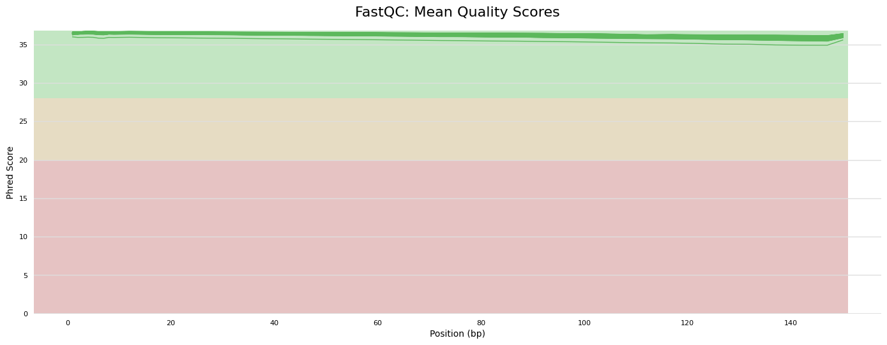
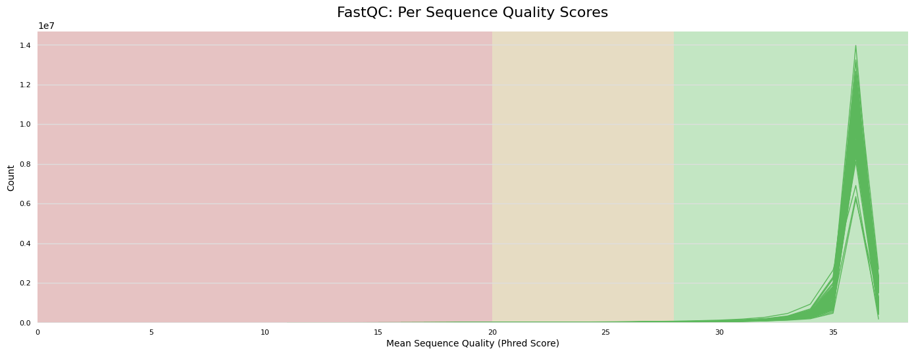
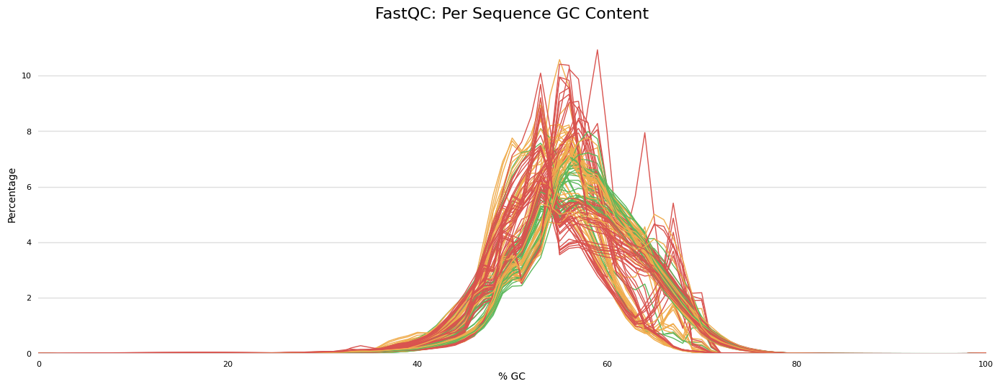

# RNA-Seq Read Quality Control

## Project setup

The transcriptomes of 12 enterobacterial strains, with and without plasmid pOXA-48, were sequenced:
* **5 clinical strains naturally carrying pOXA-48:** 1 *E. coli* (C325), 1 *C. freundii*  (CF13) and 3 *K. pneumoniae* (H53, J57 and K147) strains. pOXA-48 was cured from these strains; cured strains are denoted with the suffix *c1*.
* **6 clinical strains naive for pOXA-48 but ecologically compatible with it:** 1 *E. coli* (PF_EC10/C063) and 5 *K. pneumoniae* (PF_KPN04/K091, PF_KPN07/K141, PF_KPN10/K209, PF_KPN15/K249 and PF_KPN18/K275) strains. pOXA-48 was introduced into these strains by conjugation; transconjugants are denoted with the prefix *TC* instead of *PF*.
* **1 laboratory *E. coli* MG1655 strain.** pOXA-48 was introduced into this strain by conjugation; transconjugant is denoted with the suffix *p*.

For each strain and condition (carrying and not-carrying pOXA-48), three biological replicates were sequenced, unless a replicate showed an insufficient RIN score (these were: one replicate of CF13, one of PF_KPN10, one of TC_KPN10, one of PF_KPN15 and one of MG1655).

In a preliminary quality control that consisted in mapping the RNA-Seq Illumina reads to their respective reference genomes (not shown here), we found reads mapping to plasmid pOXA-48 in two cured replicates (one CF13c1 and one K147c1) with similar profiles to those of pOXA-48-carrying replicates, indicating that pOXA-48 was not cured from these replicates. Therefore, they were included as a third (CF13.3) or fourth (K147.4) pOXA-48-carrying replicate.

Then, the strains and replicates analyzed here (available at BioProject **PRJNA1071971**) are:

|strain.replicate|pOXA-48|fastq code|
|:----|:----|:----|
|C325.1|yes|WTCHG_872215_70255001|
|C325.2|yes|WTCHG_872215_70265002|
|C325.3|yes|WTCHG_872215_70275003|
|C325c1.1|no|WTCHG_872215_70285004|
|C325c1.2|no|WTCHG_872215_70295005|
|C325c1.3|no|WTCHG_872215_70305006|
|CF13.1|yes|WTCHG_872215_70375013|
|CF13.2|yes|WTCHG_872215_70385014|
|CF13.3|yes|WTCHG_872215_70405016|
|CF13c1.1|no|WTCHG_872215_70415017|
|CF13c1.2|no|WTCHG_872215_70425018|
|H53.1|yes|WTCHG_872215_70435019|
|H53.2|yes|WTCHG_872215_70445020|
|H53.3|yes|WTCHG_872215_70455021|
|H53c1.1|no|WTCHG_872215_70465022|
|H53c1.2|no|WTCHG_872215_70475023|
|H53c1.3|no|WTCHG_872215_70485024|
|J57.1|yes|WTCHG_872215_70495025|
|J57.2|yes|WTCHG_872215_70505026|
|J57.3|yes|WTCHG_872215_70515027|
|J57c1.1|no|WTCHG_872215_70525028|
|J57c1.2|no|WTCHG_872215_70535029|
|J57c1.3|no|WTCHG_872215_70545030|
|K147.1|yes|WTCHG_872215_70555031|
|K147.2|yes|WTCHG_872215_70565032|
|K147.3|yes|WTCHG_872215_70575033|
|K147.4|yes|WTCHG_872215_70585034|
|K147c1.1|no|WTCHG_872215_70595035|
|K147c1.2|no|WTCHG_872215_70605036|
|PF_EC10.1|no|WTCHG_872215_70615037|
|PF_EC10.2|no|WTCHG_872215_70625038|
|PF_EC10.3|no|WTCHG_872215_70635039|
|TC_EC10.1|yes|WTCHG_872215_70645040|
|TC_EC10.2|yes|WTCHG_872215_70655041|
|TC_EC10.3|yes|WTCHG_872215_70665042|
|PF_KPN04.1|no|WTCHG_872215_70675043|
|PF_KPN04.2|no|WTCHG_872215_70685044|
|PF_KPN04.3|no|WTCHG_872215_70695045|
|TC_KPN04.1|yes|WTCHG_872215_70705046|
|TC_KPN04.2|yes|WTCHG_872215_70715047|
|TC_KPN04.3|yes|WTCHG_872215_70725048|
|PF_KPN07.1|no|WTCHG_872215_70795055|
|PF_KPN07.2|no|WTCHG_872215_70805056|
|PF_KPN07.3|no|WTCHG_872215_70815057|
|TC_KPN07.1|yes|WTCHG_872215_70825058|
|TC_KPN07.2|yes|WTCHG_872215_70835059|
|TC_KPN07.3|yes|WTCHG_872215_70845060|
|PF_KPN10.1|no|WTCHG_872215_70865062|
|PF_KPN10.2|no|WTCHG_872215_70875063|
|TC_KPN10.1|yes|WTCHG_872215_70885064|
|TC_KPN10.2|yes|WTCHG_872215_70905066|
|PF_KPN15.1|no|WTCHG_872215_70745050|
|PF_KPN15.2|no|WTCHG_872215_70755051|
|TC_KPN15.1|yes|WTCHG_872215_70765052|
|TC_KPN15.2|yes|WTCHG_872215_70775053|
|TC_KPN15.3|yes|WTCHG_872215_70785054|
|PF_KPN18.1|no|WTCHG_872215_70015073|
|PF_KPN18.2|no|WTCHG_872215_70025074|
|PF_KPN18.3|no|WTCHG_872215_70035075|
|TC_KPN18.1|yes|WTCHG_872215_70045076|
|TC_KPN18.2|yes|WTCHG_872215_70055077|
|TC_KPN18.3|yes|WTCHG_872215_70065078|
|MG1655.1|no|WTCHG_872215_70075079|
|MG1655.2|no|WTCHG_872215_70085080|
|MG1655p.1|yes|WTCHG_872215_70095081|
|MG1655p.2|yes|WTCHG_872215_70105082|
|MG1655p.3|yes|WTCHG_872215_70115083|

Create the project directory from which run all commands:

```sh
mkdir -p RNA-Seq_enterobacteria_pOXA-48/RNA-Seq
cd RNA-Seq_enterobacteria_pOXA-48/RNA-Seq
```


## Read trimming and quality control

RNA-Seq raw reads (**PRJNA1071971**) were located at `./reads_RNAseq/raw_reads/`. Before trimming, we performed an initial analysis of read quality with **FastQC v0.11.9** and **MultiQC v1.11**. In general, all reads showed good quality metrics (here, for simplicity, we will only show figures of the quality metrics of the trimmed reads).

```sh
mkdir reads_RNAseq/raw_reads/fastQC_analysis/
fastqc reads_RNAseq/raw_reads/* -o reads_RNAseq/raw_reads/fastQC_analysis/
multiqc reads_RNAseq/raw_reads/fastQC_analysis/* -o reads_RNAseq/raw_reads/fastQC_analysis/multiqc
```

Reads were trimmed with **Trim Galore v0.6.4**, generating FastQC reports. Note that the base name is the prefix *WTCHG* (sequencing center) followed by the strain name and replicate number (e.g. WTCHG_TC_EC10.1):

```sh
trim_galore --quality 20 --illumina --length 50 --fastqc --basename WTCHG_<strain_name> --output_dir reads_RNAseq/ reads_RNAseq/raw_reads/<fastq1> reads_RNAseq/raw_reads/<fastq2>
```

FastQC reports were combined with **MultiQC v1.11**:

```sh
mkdir reads_RNAseq/fastQC_analysis
mv *html reads_RNAseq/fastQC_analysis/
mv *zip reads_RNAseq/fastQC_analysis/
multiqc reads_RNAseq/fastQC_analysis/* -o reads_RNAseq/fastQC_analysis/multiqc
```

#### General statistics

Most samples have >10 million reads (range 8.5-18.3 million). The GC content is 52-54% for *E. coli*, 54-56% for *C. freundii* and 55-57% for *K. pneumoniae* strains (note that MGEs and overrepresented sequences could be skewing the GC content). Finally, the percentage of duplicated sequences is 78-88% across samples, which probably represent overrepresented sequences (see below).

#### Quality scores

Reads show excellent Phred scores:




#### Per base sequence content

All sequences gave warning or fail in this module, but this is common in RNA-Seq libraries and doesn't seem to affect downstream analyses ([FastQC documentation](https://www.bioinformatics.babraham.ac.uk/projects/fastqc/Help/3%20Analysis%20Modules/4%20Per%20Base%20Sequence%20Content.html)).


#### Per sequence GC content

Again, most sequences failed or gave warning in this module, showing multiple peaks of GC content. This is probably due to the high percentage of overrepresented sequences (see below).



#### Per base N content

All samples passed this module.

#### Sequence lenght distribution

Most reads are >140 bp long after trimming, which is excellent:


#### Sequence duplication levels

All reads failed this module, which is normal in RNA-Seq libraries since highly expressed transcripts are generally over-sequenced ([FastQC documentation](https://www.bioinformatics.babraham.ac.uk/projects/fastqc/Help/3%20Analysis%20Modules/8%20Duplicate%20Sequences.html)).


#### Overrepresented sequences

All samples gave warning or fail, with percentages of overrepresented sequences ranging from <5% to almost 30%. These percentages can skew the GC content seen before, and can be common when sequencing RNA ([FastQC documentation](https://www.bioinformatics.babraham.ac.uk/projects/fastqc/Help/3%20Analysis%20Modules/9%20Overrepresented%20Sequences.html)).

#### Adapter content

All samples passed this module.


## Analysis of overrepresented sequences

Most of the overrepresented sequences (~78%) are commonly present in more than one sample, counted up to 66 times across all samples:

```sh
# get all the overrepresented sequences from the FastQC output (of trimmed reads) and find the unique ones, with count:
unzip -p reads_RNAseq/fastQC_analysis/\*zip \*/fastqc_data.txt | sed -n '/>>Overrepresented/,/>>END_MODULE/{/>>END_MODULE/!p}' | grep -E "^[A|T|G|C]" | cut -f1 | sort | uniq -c | sort -rn
# storing the sequences in a fasta file:
unzip -p reads_RNAseq/fastQC_analysis/\*zip \*/fastqc_data.txt | sed -n '/>>Overrepresented/,/>>END_MODULE/{/>>END_MODULE/!p}' | grep -E "^[A|T|G|C]" | cut -f1 | sort | uniq -c | sort -rn | awk '{print $2}' | awk '{printf("%s%s\n", (++num==1 ? "" : ">"num"\n"), $0)}' | sed '1s/^/>1\n/' > reads_RNAseq/overrepresented_sequences.fasta
```

We analyzed to what genetic features the overrepresented sequences correspond. For this, they were blasted (**BLASTn v2.11.0**) against the reference genomes, storing the hits in BED format:

```sh
mkdir blastn_overrepresented_seqs
makeblastdb -in ../../Closed_sequences/C325.fasta -dbtype nucl
makeblastdb -in ../../Closed_sequences/CF13.fasta -dbtype nucl
makeblastdb -in ../../Closed_sequences/H53.fasta -dbtype nucl
makeblastdb -in ../../Closed_sequences/J57.fasta -dbtype nucl
makeblastdb -in ../../Closed_sequences/K147.fasta -dbtype nucl
makeblastdb -in ../../Closed_sequences/MG1655p.fasta -dbtype nucl
makeblastdb -in ../../Closed_sequences/TC_EC10.fasta -dbtype nucl
makeblastdb -in ../../Closed_sequences/TC_KPN04.fasta -dbtype nucl
makeblastdb -in ../../Closed_sequences/TC_KPN07.fasta -dbtype nucl
makeblastdb -in ../../Closed_sequences/TC_KPN10.fasta -dbtype nucl
makeblastdb -in ../../Closed_sequences/TC_KPN15.fasta -dbtype nucl
makeblastdb -in ../../Closed_sequences/TC_KPN18.fasta -dbtype nucl

# the blast table is filtered by 100% identity and full alignment length (50 bp), then only the chr, start and end of the match is stored (BED format):
blastn -query reads_RNAseq/overrepresented_sequences.fasta -db ../../Closed_sequences/C325.fasta -outfmt 6 | awk '{ if ($3 == "100.000" && $4 == "50") { print $2"\t"$9"\t"$10 } }' | awk '{ if ($3-$2 < 0) {print $1"\t"$3"\t"$2} else {print $1"\t"$2"\t"$3} }' > blastn_overrepresented_seqs/C325.bed
blastn -query reads_RNAseq/overrepresented_sequences.fasta -db ../../Closed_sequences/CF13.fasta -outfmt 6 | awk '{ if ($3 == "100.000" && $4 == "50") { print $2"\t"$9"\t"$10 } }' | awk '{ if ($3-$2 < 0) {print $1"\t"$3"\t"$2} else {print $1"\t"$2"\t"$3} }' > blastn_overrepresented_seqs/CF13.bed
blastn -query reads_RNAseq/overrepresented_sequences.fasta -db ../../Closed_sequences/H53.fasta -outfmt 6 | awk '{ if ($3 == "100.000" && $4 == "50") { print $2"\t"$9"\t"$10 } }' | awk '{ if ($3-$2 < 0) {print $1"\t"$3"\t"$2} else {print $1"\t"$2"\t"$3} }' > blastn_overrepresented_seqs/H53.bed
blastn -query reads_RNAseq/overrepresented_sequences.fasta -db ../../Closed_sequences/J57.fasta -outfmt 6 | awk '{ if ($3 == "100.000" && $4 == "50") { print $2"\t"$9"\t"$10 } }' | awk '{ if ($3-$2 < 0) {print $1"\t"$3"\t"$2} else {print $1"\t"$2"\t"$3} }' > blastn_overrepresented_seqs/J57.bed
blastn -query reads_RNAseq/overrepresented_sequences.fasta -db ../../Closed_sequences/K147.fasta -outfmt 6 | awk '{ if ($3 == "100.000" && $4 == "50") { print $2"\t"$9"\t"$10 } }' | awk '{ if ($3-$2 < 0) {print $1"\t"$3"\t"$2} else {print $1"\t"$2"\t"$3} }' > blastn_overrepresented_seqs/K147.bed
blastn -query reads_RNAseq/overrepresented_sequences.fasta -db ../../Closed_sequences/MG1655p.fasta -outfmt 6 | awk '{ if ($3 == "100.000" && $4 == "50") { print $2"\t"$9"\t"$10 } }' | awk '{ if ($3-$2 < 0) {print $1"\t"$3"\t"$2} else {print $1"\t"$2"\t"$3} }' > blastn_overrepresented_seqs/MG1655p.bed
blastn -query reads_RNAseq/overrepresented_sequences.fasta -db ../../Closed_sequences/TC_EC10.fasta -outfmt 6 | awk '{ if ($3 == "100.000" && $4 == "50") { print $2"\t"$9"\t"$10 } }' | awk '{ if ($3-$2 < 0) {print $1"\t"$3"\t"$2} else {print $1"\t"$2"\t"$3} }' > blastn_overrepresented_seqs/TC_EC10.bed
blastn -query reads_RNAseq/overrepresented_sequences.fasta -db ../../Closed_sequences/TC_KPN04.fasta -outfmt 6 | awk '{ if ($3 == "100.000" && $4 == "50") { print $2"\t"$9"\t"$10 } }' | awk '{ if ($3-$2 < 0) {print $1"\t"$3"\t"$2} else {print $1"\t"$2"\t"$3} }' > blastn_overrepresented_seqs/TC_KPN04.bed
blastn -query reads_RNAseq/overrepresented_sequences.fasta -db ../../Closed_sequences/TC_KPN07.fasta -outfmt 6 | awk '{ if ($3 == "100.000" && $4 == "50") { print $2"\t"$9"\t"$10 } }' | awk '{ if ($3-$2 < 0) {print $1"\t"$3"\t"$2} else {print $1"\t"$2"\t"$3} }' > blastn_overrepresented_seqs/TC_KPN07.bed
blastn -query reads_RNAseq/overrepresented_sequences.fasta -db ../../Closed_sequences/TC_KPN10.fasta -outfmt 6 | awk '{ if ($3 == "100.000" && $4 == "50") { print $2"\t"$9"\t"$10 } }' | awk '{ if ($3-$2 < 0) {print $1"\t"$3"\t"$2} else {print $1"\t"$2"\t"$3} }' > blastn_overrepresented_seqs/TC_KPN10.bed
blastn -query reads_RNAseq/overrepresented_sequences.fasta -db ../../Closed_sequences/TC_KPN15.fasta -outfmt 6 | awk '{ if ($3 == "100.000" && $4 == "50") { print $2"\t"$9"\t"$10 } }' | awk '{ if ($3-$2 < 0) {print $1"\t"$3"\t"$2} else {print $1"\t"$2"\t"$3} }' > blastn_overrepresented_seqs/TC_KPN15.bed
blastn -query reads_RNAseq/overrepresented_sequences.fasta -db ../../Closed_sequences/TC_KPN18.fasta -outfmt 6 | awk '{ if ($3 == "100.000" && $4 == "50") { print $2"\t"$9"\t"$10 } }' | awk '{ if ($3-$2 < 0) {print $1"\t"$3"\t"$2} else {print $1"\t"$2"\t"$3} }' > blastn_overrepresented_seqs/TC_KPN18.bed
```

Next, **bedtools v2.27.1** is used to find the gene annotation matching the overrepresented regions. The number of matches per gene, per strain, is counted:

```sh
bedtools intersect -wa -wb -a blastn_overrepresented_seqs/C325.bed -b ../../Closed_sequences/C325.gff | awk '{ if ($6 == "gene") {print $0} }' | cut -d";" -f2 | cut -d"=" -f2 | sort | uniq -c | sort -rn
bedtools intersect -wa -wb -a blastn_overrepresented_seqs/CF13.bed -b ../../Closed_sequences/CF13.gff | awk '{ if ($6 == "gene") {print $0} }' | cut -d";" -f2 | cut -d"=" -f2 | sort | uniq -c | sort -rn
bedtools intersect -wa -wb -a blastn_overrepresented_seqs/H53.bed -b ../../Closed_sequences/H53.gff | awk '{ if ($6 == "gene") {print $0} }' | cut -d";" -f2 | cut -d"=" -f2 | sort | uniq -c | sort -rn
bedtools intersect -wa -wb -a blastn_overrepresented_seqs/J57.bed -b ../../Closed_sequences/J57.gff | awk '{ if ($6 == "gene") {print $0} }' | cut -d";" -f2 | cut -d"=" -f2 | sort | uniq -c | sort -rn
bedtools intersect -wa -wb -a blastn_overrepresented_seqs/K147.bed -b ../../Closed_sequences/K147.gff | awk '{ if ($6 == "gene") {print $0} }' | cut -d";" -f2 | cut -d"=" -f2 | sort | uniq -c | sort -rn
bedtools intersect -wa -wb -a blastn_overrepresented_seqs/MG1655p.bed -b ../../Closed_sequences/MG1655p.gff | awk '{ if ($6 == "gene") {print $0} }' | cut -d";" -f2 | cut -d"=" -f2 | sort | uniq -c | sort -rn
bedtools intersect -wa -wb -a blastn_overrepresented_seqs/TC_EC10.bed -b ../../Closed_sequences/TC_EC10.gff | awk '{ if ($6 == "gene") {print $0} }' | cut -d";" -f2 | cut -d"=" -f2 | sort | uniq -c | sort -rn
bedtools intersect -wa -wb -a blastn_overrepresented_seqs/TC_KPN04.bed -b ../../Closed_sequences/TC_KPN04.gff | awk '{ if ($6 == "gene") {print $0} }' | cut -d";" -f2 | cut -d"=" -f2 | sort | uniq -c | sort -rn
bedtools intersect -wa -wb -a blastn_overrepresented_seqs/TC_KPN07.bed -b ../../Closed_sequences/TC_KPN07.gff | awk '{ if ($6 == "gene") {print $0} }' | cut -d";" -f2 | cut -d"=" -f2 | sort | uniq -c | sort -rn
bedtools intersect -wa -wb -a blastn_overrepresented_seqs/TC_KPN10.bed -b ../../Closed_sequences/TC_KPN10.gff | awk '{ if ($6 == "gene") {print $0} }' | cut -d";" -f2 | cut -d"=" -f2 | sort | uniq -c | sort -rn
bedtools intersect -wa -wb -a blastn_overrepresented_seqs/TC_KPN15.bed -b ../../Closed_sequences/TC_KPN15.gff | awk '{ if ($6 == "gene") {print $0} }' | cut -d";" -f2 | cut -d"=" -f2 | sort | uniq -c | sort -rn
bedtools intersect -wa -wb -a blastn_overrepresented_seqs/TC_KPN18.bed -b ../../Closed_sequences/TC_KPN18.gff | awk '{ if ($6 == "gene") {print $0} }' | cut -d";" -f2 | cut -d"=" -f2 | sort | uniq -c | sort -rn
```

To facilitate analysis, the list of gene names that match overrepresented sequences is stored...

```sh
bedtools intersect -wa -wb -a blastn_overrepresented_seqs/C325.bed -b ../../Closed_sequences/C325.gff | awk '{ if ($6 == "gene") {print $0} }' | cut -d";" -f2 | cut -d"=" -f2 | sort > blastn_overrepresented_seqs/C325_number_hits.txt
bedtools intersect -wa -wb -a blastn_overrepresented_seqs/CF13.bed -b ../../Closed_sequences/CF13.gff | awk '{ if ($6 == "gene") {print $0} }' | cut -d";" -f2 | cut -d"=" -f2 | sort > blastn_overrepresented_seqs/CF13_number_hits.txt
bedtools intersect -wa -wb -a blastn_overrepresented_seqs/H53.bed -b ../../Closed_sequences/H53.gff | awk '{ if ($6 == "gene") {print $0} }' | cut -d";" -f2 | cut -d"=" -f2 | sort > blastn_overrepresented_seqs/H53_number_hits.txt
bedtools intersect -wa -wb -a blastn_overrepresented_seqs/J57.bed -b ../../Closed_sequences/J57.gff | awk '{ if ($6 == "gene") {print $0} }' | cut -d";" -f2 | cut -d"=" -f2 | sort > blastn_overrepresented_seqs/J57_number_hits.txt
bedtools intersect -wa -wb -a blastn_overrepresented_seqs/K147.bed -b ../../Closed_sequences/K147.gff | awk '{ if ($6 == "gene") {print $0} }' | cut -d";" -f2 | cut -d"=" -f2 | sort > blastn_overrepresented_seqs/K147_number_hits.txt
bedtools intersect -wa -wb -a blastn_overrepresented_seqs/MG1655p.bed -b ../../Closed_sequences/MG1655p.gff | awk '{ if ($6 == "gene") {print $0} }' | cut -d";" -f2 | cut -d"=" -f2 | sort > blastn_overrepresented_seqs/MG1655p_number_hits.txt
bedtools intersect -wa -wb -a blastn_overrepresented_seqs/TC_EC10.bed -b ../../Closed_sequences/TC_EC10.gff | awk '{ if ($6 == "gene") {print $0} }' | cut -d";" -f2 | cut -d"=" -f2 | sort > blastn_overrepresented_seqs/TC_EC10_number_hits.txt
bedtools intersect -wa -wb -a blastn_overrepresented_seqs/TC_KPN04.bed -b ../../Closed_sequences/TC_KPN04.gff | awk '{ if ($6 == "gene") {print $0} }' | cut -d";" -f2 | cut -d"=" -f2 | sort > blastn_overrepresented_seqs/TC_KPN04_number_hits.txt
bedtools intersect -wa -wb -a blastn_overrepresented_seqs/TC_KPN07.bed -b ../../Closed_sequences/TC_KPN07.gff | awk '{ if ($6 == "gene") {print $0} }' | cut -d";" -f2 | cut -d"=" -f2 | sort > blastn_overrepresented_seqs/TC_KPN07_number_hits.txt
bedtools intersect -wa -wb -a blastn_overrepresented_seqs/TC_KPN10.bed -b ../../Closed_sequences/TC_KPN10.gff | awk '{ if ($6 == "gene") {print $0} }' | cut -d";" -f2 | cut -d"=" -f2 | sort > blastn_overrepresented_seqs/TC_KPN10_number_hits.txt
bedtools intersect -wa -wb -a blastn_overrepresented_seqs/TC_KPN15.bed -b ../../Closed_sequences/TC_KPN15.gff | awk '{ if ($6 == "gene") {print $0} }' | cut -d";" -f2 | cut -d"=" -f2 | sort > blastn_overrepresented_seqs/TC_KPN15_number_hits.txt
bedtools intersect -wa -wb -a blastn_overrepresented_seqs/TC_KPN18.bed -b ../../Closed_sequences/TC_KPN18.gff | awk '{ if ($6 == "gene") {print $0} }' | cut -d";" -f2 | cut -d"=" -f2 | sort > blastn_overrepresented_seqs/TC_KPN18_number_hits.txt

# ... and the number of matches per gene, merging all strains together, is printed:
cat blastn_overrepresented_seqs/*hits.txt | sort | uniq -c | sort -rn
```

The output of the cat command is:

```
1043 ssrA
 773 rnpB
  43 grcA
  33 cspE
  24 lpp
  24 gapA
  19 tnaA
  15 adhE
   8 pgaptmp_002101
   7 uspG
   7 pgk
   7 pgaptmp_000021
   7 pflB
   4 pgaptmp_002193
   4 pgaptmp_002123
   4 pgaptmp_002080
   4 pgaptmp_002063
   4 pgaptmp_002061
   4 pgaptmp_002060
   4 aac(3)-IIe
   1 pgaptmp_000015
```

In all strains, *ssrA* (or tmRNA) and *rnpB* (RNase P) are the most overrepresented genes; other could be *grcA*, *cspE*, *lpp*, *gapA*, *tnaA* or *adhE*. In [Hall *et al.* (2021)](https://doi.org/10.1371/journal.pbio.3001225) these genes were also overrepresented. The authors discussed that "overall the overrepresented sequences make biological sense and are unlikely to have emerged from low quality or bias in the library preparation", so we proceeded with the RNA-Seq analyses.
